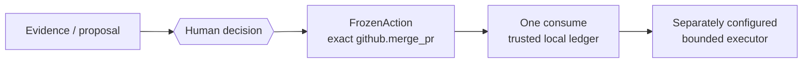

# Mothership

<p align="center"></p>

> Give AI the capability to prepare work. Keep authority with the human.
>
> One human decision. One exact supported action. One use.

Mothership is a field-built reference implementation and executable design thesis for a bounded Action Authority.
It defines a narrow boundary for relating one human decision to one exact supported action with a short validity window
and one consumption.

It is not an enterprise product, medical product, production authority service, or generic agent-security platform.

## Current public scope

The only current public action profile is `github.merge_pr`. The public package ships no AI model, live executor,
verifier producer, credential manager, or medical function. Its default CLI performs no consequential external mutation.

The exact action scope is:

- repository
- pull request number
- expected head SHA
- expected base branch name
- merge method

Repository, PR number, expected head SHA, expected base branch name, and merge method are fixed. The base commit SHA is
not bound. `expires_at` is not included in the action digest. Integrations must issue a fresh `action_id` for each freeze,
correlate the response to the exact live issuance and expiry shown to the human, and reject delayed or reused responses.

Human identity is not authenticated. One-shot replay protection is scoped to one trusted local ledger history. Copied or
restored ledgers are another replay domain. A process fork after issuance is not process-identity isolation.

## Public result

The [PR #18 bounded public result](docs/evidence/github-merge-pr-e2e-20260903/README.md) records one `github.merge_pr`
trial against an isolated canary base. Public GitHub read-back records the target head SHA, merge commit, parents,
and bounded diff. This is one result for PR #18 only. It does not claim publicly reproducible private lifecycle traces,
generic safety, or production readiness.

## Boundary model



Evidence and proposals are decision inputs. The human decision is caller-attested and bound to the exact action digest.
The executor after `FrozenAction` consumption is separately configured. Mothership does not call a model or mutate GitHub.

## Quick start

<!-- quickstart:start -->
```sh
python3 -m venv .venv
. .venv/bin/activate
python -m pip install .
mothership verify
mothership demo
```
<!-- quickstart:end -->

`mothership verify` checks the bundled resource inventory, schemas, registry, fixtures, and digests. It does not check
all installed code, the host, or external safety. `mothership demo` is the legacy 0.2 synthetic protocol-composition
demo. It is not Authority Core proof, agent execution, human approval, or evidence that a real task completed.

## What it provides

- validation and freezing for one exact `github.merge_pr` action
- binding of a caller-attested human decision to the action SHA-256
- ledger recording and one-shot consumption in a trusted local history
- strict JSON contracts, a compatibility registry, and offline checks for bundled resources and fixtures
- read-only validation of legacy 0.2 protocols and a synthetic demo

Decision Approval (review evidence) and Action Authority Decision (consequential authority) are separate. A Decision
Card does not automatically become a `FrozenAction`; the caller supplies exact parameters separately.

## Code tour

- [`orchestration/lib/action_authority.py`](orchestration/lib/action_authority.py) — action freeze and decision transport
- [`orchestration/lib/action_authority_ledger.py`](orchestration/lib/action_authority_ledger.py) — ledger append and one-shot consume
- [`orchestration/lib/external_action.py`](orchestration/lib/external_action.py) — receipt and verification record contracts
- [`tests/test_action_authority.py`](tests/test_action_authority.py) — Authority Core boundary tests
- [`tests/test_action_authority_ledger.py`](tests/test_action_authority_ledger.py) — replay and ledger-history tests
- [`tests/test_external_action_contracts.py`](tests/test_external_action_contracts.py) — external action contract tests

## Current limitations

| Area | The public implementation supports | It does not claim |
| --- | --- | --- |
| identity | caller-attested decisions | human identity authentication |
| replay | one-use consumption in one trusted local ledger history | global replay prevention across copied/restored ledgers |
| action scope | five exact parameters for `github.merge_pr` | base-commit binding or arbitrary operations |
| expiry | a short TTL that is shown and checked | binding `expires_at` into the digest |
| execution | returning data for a separate executor | a live executor, credentials, retries, or a daemon |
| verification | shape and binding checks for separate records | verifier identity or read-only behavior |
| package check | offline checks of bundled inventory and digests | host, all installed code, or external safety |
| public result | one bounded PR #18 result | generic safety, production readiness, or private-trace reproducibility |

## Incident origin

The design carries concise lessons from real operational incidents. A human approved deletion of 21 files; pattern
expansion at execution deleted 94. The approval was real, but the approved set was never frozen. Mothership therefore
rejects unreviewed fields and keeps action scope closed and exact.

A second incident reported success after an unchecked tool failure. Mothership therefore does not treat labels as
evidence, and separates executor receipts from independent verification with fail-closed validation.

## 0.2 compatibility

Frontdoor, WGM, Router, and Secretary protocols remain a legacy interoperability and history surface. They are not the
current Authority Core execution path. `mothership demo` checks four bundled fictional documents offline. Mothership does
not discover, install, or execute companions.

## Documentation

- [Architecture](docs/architecture.md)
- [Installation](docs/installation.md)
- [Protocols](docs/protocols.md)
- [Security model](docs/security.md)
- [Composition guide](docs/composition.md)
- [0.2 compatibility history](docs/legacy/compatibility-0.2.md)
- [日本語README](README.md)

## License

MIT. See [LICENSE](LICENSE).
