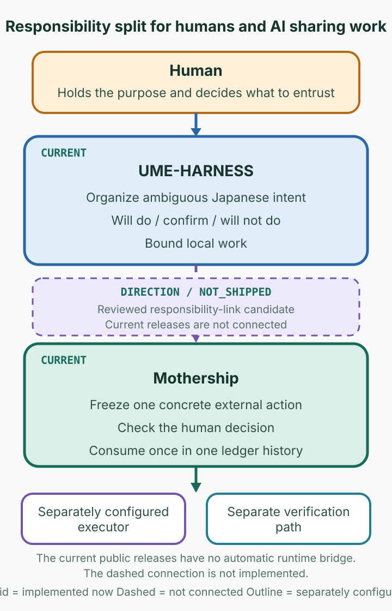
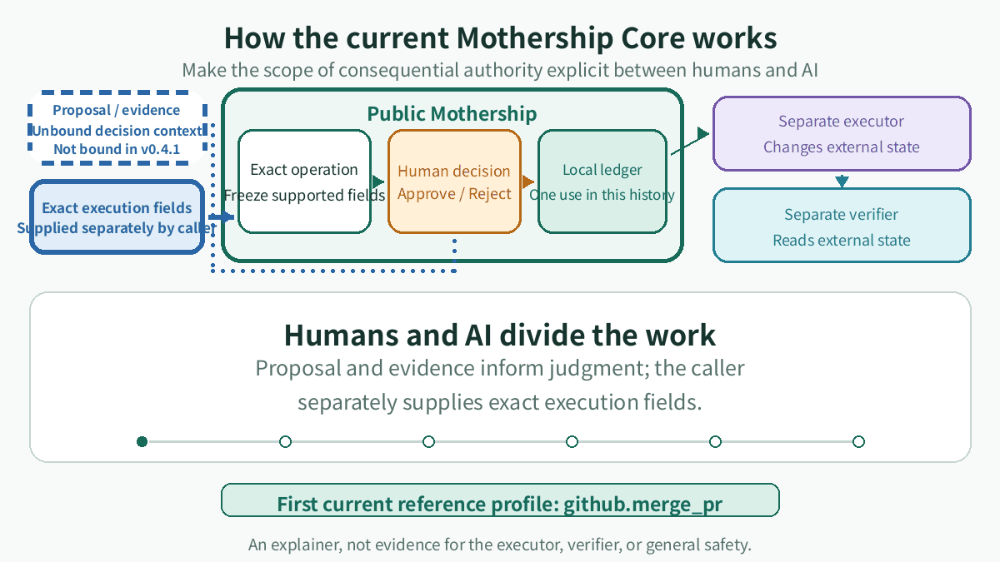
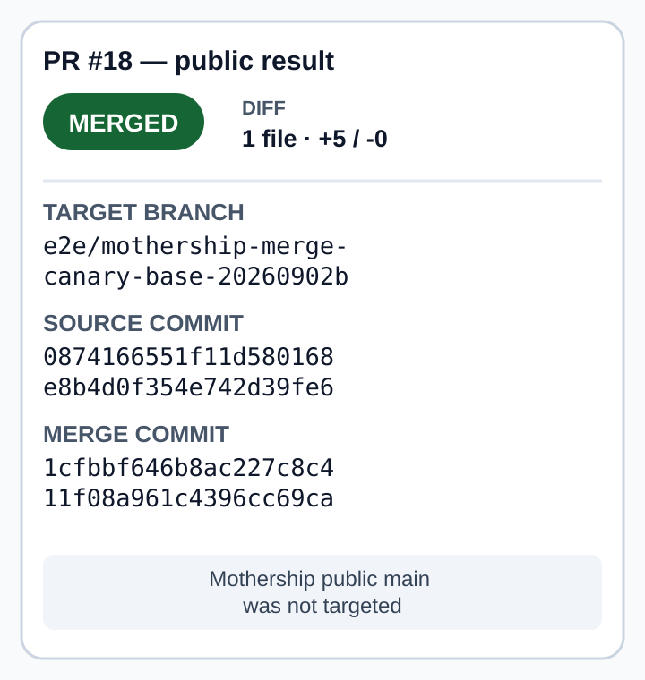

# Mothership

[日本語](README.md) · [v0.4.1](https://github.com/UMEBOSHIISAN/mothership/releases/tag/v0.4.1) ·
[CI](https://github.com/UMEBOSHIISAN/mothership/actions)

<p align="center">
  
</p>

This main-branch README includes unreleased documentation and onboarding follow-up to the historical v0.4.1 release.
The runtime version remains v0.4.1; the next candidate is a docs-only v0.4.2.

> Humans should not have to do everything.
> Nor should they hand everything over to AI.
>
> Make the scope of entrusted work explicit
> between humans and AI.

Mothership is an open-source reference implementation for
bounded authority handoff in AI-assisted work.

It freezes an exact supported operation, checks the human decision
against that operation, and permits one consume within one trusted
local ledger history.

Mothership does not choose the work, run a model, or execute
the external operation itself.

## PURPOSE

Sharing work between humans and AI requires separating what a system can do
from what it may do. Mothership exists to make that handoff explicit so a
human can entrust concrete work without surrendering all control.

| Distinction | Meaning |
| --- | --- |
| Capability | what an AI or tool can do |
| Authority | which part it may do |
| Decision | what a human chose to entrust this time |
| Execution | what operation actually occurred |

Security is not the product category. It is a condition for keeping those
responsibilities distinct.

## Responsibility split

UME-HARNESS turns human intent into a bounded local-work preview.
Mothership binds a human decision to bounded authority for one external action.

<p align="center">
  
</p>

This diagram shows a responsibility direction. The current public releases have no automatic runtime bridge. The dashed connection is not implemented.
The external executor and verifier are separately configured too.

## CURRENT: v0.4.1

The public implementation freezes one supported external operation, checks a
caller-attested human decision, records it in a local ledger, and permits one
consume.

Implemented:

- validation and freezing of supported parameters into a `FrozenAction`
- approve/reject checks against the action ID and digest
- local recording of decision events
- one consume in the same trusted local ledger history
- closed contracts that separate an executor Receipt from Verification

Not shipped:

- an automatic UME-HARNESS runtime bridge
- a general executor, verifier producer, credential manager, retry, or daemon
- human identity authentication
- arbitrary operation profiles or autonomous execution

Proposal and evidence are decision context, but they are not mechanically bound to a FrozenAction in v0.4.1.
Mothership receives the supported execution parameters separately and freezes them first.
Human identity is not authenticated.

## How the current Mothership Core works

<p align="center">
  <picture>
    <source media="(prefers-reduced-motion: reduce)" srcset="assets/readme/en/mothership-flow-poster.png">
    <source media="(max-width: 600px)" srcset="assets/readme/en/mothership-flow-poster.png">
    
  </picture>
</p>

This is an explanatory diagram, not execution evidence.
Reduced-motion settings and screens up to 600px use the equivalent vertical static poster.

Supported parameters are frozen before a caller-attested decision is checked
against the action ID and digest and recorded. The same action ID can be
consumed once within one trusted local ledger history.

## Current reference profile

The first current reference profile is `github.merge_pr`.
It is not the identity or full intended use of Mothership. It is the first
concrete example that closes the five execution parameters, decision check,
ledger record, and one-use consume boundary.

The current profile fixes:

- repository
- pull request number
- expected head SHA
- expected base branch name
- merge method

The base commit SHA is not bound. `expires_at` is not included in the action digest.
Integrations must issue a fresh `action_id` for every freeze. They must correlate the response to the exact live issuance and displayed expiry,
and reject delayed or reused responses.

## One public result

The [bounded public result for PR #18](docs/evidence/github-merge-pr-e2e-20260903/README.md)
records one `github.merge_pr` against an isolated canary base. Public GitHub
read-back shows the target head SHA, merge commit, parents, and bounded diff size.

<p align="center">
  
</p>

This is one public result for PR #18. It does not claim that the private
lifecycle is reproducible from public material, generic safety, or production suitability.

## Quick start

<!-- quickstart:start -->
```sh
python3 -m venv .venv
. .venv/bin/activate
python -m pip install .
python examples/authority_core_walkthrough.py
mothership verify
```
<!-- quickstart:end -->

`python examples/authority_core_walkthrough.py` runs without network access or credentials. It shows exact action freeze,
derived display, human decision recording, one consume, and rejection of a second consume. It does not change GitHub or
start an executor or verifier.

`mothership verify` checks bundled resource inventory, schemas, registry,
fixtures, and digests offline. It does not check the host, external safety,
or every installed byte.

`mothership demo` is the legacy 0.2 synthetic protocol-composition demo.
It is not Authority Core proof, agent execution, human approval, or evidence
that a real task completed. It is not the current Authority Core onboarding path.

## Current limitations

| Area | Implemented in v0.4.1 | Not implemented or certified |
| --- | --- | --- |
| identity | caller-attested decisions | human identity authentication |
| decision events | Multiple decision events may be recorded for the same action | one terminal decision, supersession, or revocation |
| consume | one consume per action ID in one trusted ledger history | global replay prevention across copied or restored ledgers |
| action scope | five exact `github.merge_pr` parameters | base-commit binding or arbitrary operations |
| expiry | a short TTL that is shown and checked | binding `expires_at` into the action digest |
| execution | data returned for a separate executor | a live executor, credentials, retries, or a daemon |
| verification | shape and binding checks for Receipt and Verification | verifier-producer identity or read-only behavior |
| package check | bundled inventory and digest checks | host, all installed code, or external safety |
| public result | one bounded PR #18 result | generic safety, production readiness, or private-trace reproducibility |

This reference implementation is not certified for production or regulated
high-stakes deployment. One-use enforcement is scoped to one trusted local
ledger history.

## Documentation

### Code tour

- [`orchestration/lib/action_authority.py`](orchestration/lib/action_authority.py) — action freeze and decision transport
- [ledger implementation](orchestration/lib/action_authority_ledger.py) — append and one-shot consume
- [external-action contracts](orchestration/lib/external_action.py) — Receipt and Verification records
- [`tests/test_action_authority.py`](tests/test_action_authority.py) — Authority Core boundary tests
- [ledger tests](tests/test_action_authority_ledger.py) — replay and ledger-history tests
- [external-action tests](tests/test_external_action_contracts.py) — external-action contract tests

### Origin and compatibility

This boundary carries lessons from incidents where the reviewed target changed
before execution and where an unchecked tool failure was summarized as success.
Labels are not evidence; unknown results stop.

Frontdoor, WGM, Router, and Secretary protocols remain for legacy 0.2
compatibility and history. They are not the current Authority Core path.

### References

- [Architecture](docs/architecture.md)
- [Installation](docs/installation.md)
- [Protocols](docs/protocols.md)
- [Security model](docs/security.md)
- [Composition guide](docs/composition.md)
- [0.2 compatibility history](docs/legacy/compatibility-0.2.md)
- [日本語README](README.md)

## License

The project code is MIT; see [LICENSE](LICENSE). The bundled Noto Sans JP font
used to generate README assets remains under the
[SIL Open Font License 1.1](assets/readme/source/fonts/OFL-1.1.txt).
