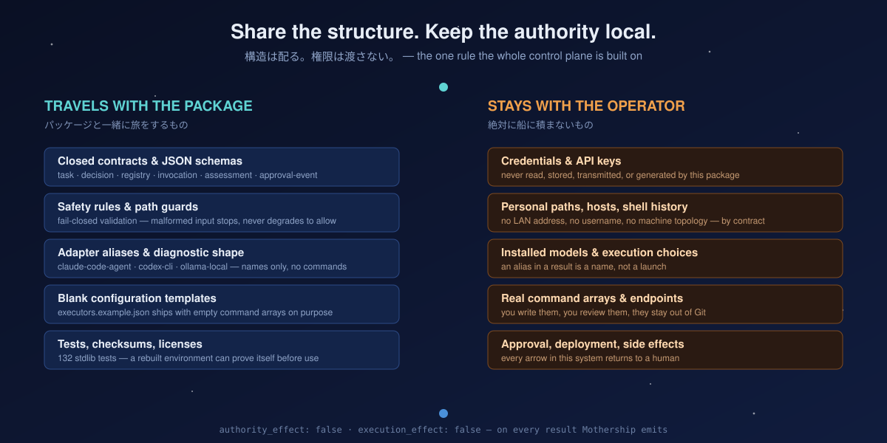
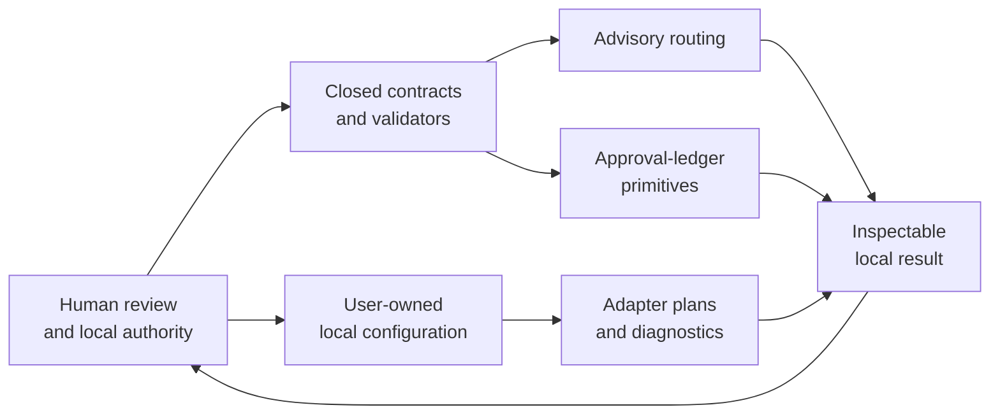

<p align="center">
  
</p>

<h1 align="center">Mothership</h1>

<p align="center">
  <b>Ship your AI coding cockpit — not your secrets.</b><br>
  <sub>AIコーディング環境の「操縦席」だけを持ち運ぶ。鍵は置いていく。</sub>
</p>

<p align="center">
  
  
  
  
  
  
</p>

<p align="center">
  <a href="docs/ja/README.md">日本語</a> ·
  <a href="docs/architecture.md">Architecture</a> ·
  <a href="docs/installation.md">Installation</a> ·
  <a href="docs/security.md">Security model</a> ·
  <a href="docs/composition.md">Composition</a> ·
  <a href="docs/ecosystem-roadmap.md">Roadmap</a>
</p>

---

You built a good AI coding setup. Claude Code here, Codex CLI there, a local model on a second machine, a hook you wrote at 2 a.m. that you now depend on.

Then you get a new laptop.

**Copying your home directory is fast and unsafe. Rebuilding from memory is safe and slow.** Mothership is the third option: package the contracts, diagnostics, and evidence shapes that make an environment *intelligible* — and leave the credentials, paths, and execution authority where they belong.

> あなたの AI 開発環境は、たぶん一台のマシンと、あなたの頭の中にしか存在しない。丸ごとコピーすれば速いが危険で、記憶から組み直せば安全だが遅い。Mothership はその間にある第三の選択肢 — 環境を「理解可能にしている構造」だけを配り、鍵と権限は手元に残す。

---

## 30 seconds

```sh
git clone https://github.com/UMEBOSHIISAN/mothership.git
cd mothership
PYTHONDONTWRITEBYTECODE=1 python3 -m unittest discover -s tests   # 132 tests
./bootstrap/doctor.sh | python3 -m json.tool
```

The diagnostic tells you what your machine actually has, without launching anything:

```json
[
  {
    "adapter_id": "claude-code-agent",
    "status": "available",
    "authority_effect": "none",
    "local_model_present": null,
    "limitations": ["authentication-external", "binary-trust-external", "managed-policy-external"],
    "version_sha256": "c92d556fba6736…"
  },
  {
    "adapter_id": "codex-cli",
    "status": "unavailable",
    "authority_effect": "none"
  },
  {
    "adapter_id": "ollama-local",
    "status": "unavailable",
    "local_model_present": false
  }
]
```

Read that output carefully, because it is the whole philosophy in one payload:

- `status: available` means **the binary exists**. It does not mean you are authenticated, that the binary is trustworthy, or that a policy allows it. Those three unknowns are named in `limitations` instead of being quietly assumed away.
- `authority_effect: "none"` appears on **every** result Mothership produces. There is no code path that emits anything else.
- Nothing was launched. Nothing hit the network. The exit status is a *diagnosis*, not a request to install something.

> 「使える」と「動かしていい」は違う。この JSON はそれを混ぜない。`available` はバイナリの存在だけを意味し、認証・信頼・ポリシーの3つは未知のまま `limitations` に明示される。

---

## Why this exists

This is not a thought experiment about agent safety. It is the residue of running one.

For most of 2026 I have operated a small e-commerce business where a fleet of AI agents does real work every day: drafting posts, watching the shipping queue, auditing repositories, reviewing each other's code. Claude Code, Codex CLI, and local models on a second Mac, coordinating across machines.

Then the machine that ran all of it — the mothership — was retired.

Everything worked. Nothing was writable down. The scheduler jobs, the approval conventions, the hooks, the "don't let it do that" rules I had learned the hard way — all of it lived in one computer and one person's head. Recreating it took far longer than it should have, and the parts I could not describe were exactly the parts that mattered.

**An environment you cannot hand to someone else is an environment you do not actually own.**

This repository is the portable half of that setup: the contracts, the boundaries, the diagnostics, the shapes that evidence has to take. Not the machine. Not the keys. Not the authority.

> 2026年の大半、私は小さなEC事業を回しながら、複数のAIエージェントに毎日実務をさせてきた。投稿の下書き、発送キューの監視、リポジトリ監査、互いのコードレビュー。その全部を動かしていた母艦マシンが退役した時、**動いていたのに、書き出せなかった**。手順もフックも「これはやらせない」という規律も、一台のマシンと一人の頭の中にしかなかった。**他人に渡せない環境は、自分のものではない。** このリポジトリは、その環境の「渡せる側の半分」だ。

---

## Every boundary here is a scar

Most safety documentation is written before the accident. This one was written after six of them.

<p align="center">
  
</p>

Read the left column again. None of those are hypothetical attacks by a sophisticated adversary. They are ordinary Tuesday failures:

**A wider glob at execution time than at review time.** A human looked at a list of 21 files and said yes. The command that ran re-expanded the pattern and deleted 94. The approval was real; the *set* it applied to was not frozen. That is why the contracts in this repository are closed — an undocumented field is rejected rather than absorbed, because "absorbing input the reviewer never saw" is the exact shape of that failure.

**A silent tool failure filled in with fiction.** A command failed, the failure was not checked, and the summary reported success with plausible invented results. The lesson is not "be more careful." It is that a *label* is not evidence — which is why validation here fails closed and never degrades into permissive prose.

**148+ private network addresses committed across 11 repositories.** No attacker involved. Just the fact that a concrete value reads better in documentation than a placeholder does. Now the shipped config (`config/executors.example.json`) contains **empty command arrays on purpose**. It is unusable until a human fills it in, and that is the feature.

**A ledger that said `COMMITTED` while the change sat in the work tree.** Three separate times. Real fix, real verification — only the persistence step was skipped, and the label outran the state. Approval events in this repo are durable inspectable data for exactly that reason.

**A multi-step prompt injection aiming at customer data.** Caught before egress; zero actual impact. But it settled an argument: an agent that can reach the network *is* an exfiltration path, no matter how well-behaved it usually is. Mothership makes no network requests. There is nothing to hijack because there is nothing that can act.

That last one deserves a number. In a separate internal experiment I ran 1,021 trials measuring when tool-augmented LLM agents violate a "propose only, do not act" instruction. **Without tool access: 3.6% violation. With tool access: 82.0%.** Tool availability dominated every other variable tested — model, temperature, prompt framing, authority phrasing. *(That study is not yet public, so treat the figure as an unverified internal result, not a citation.)*

If a single switch moves boundary violation from 3.6% to 82%, the honest design response is not a better prompt. It is to not ship the switch. That is why this package has no execution path at all.

---

## Share the structure. Keep the authority local.

<p align="center">
  
</p>

Every arrow in this system returns to a human. Mothership can validate, describe, and record bounded state. It deliberately cannot cross into execution or authority.

---

## What you actually get

| Capability | What it provides | Why it matters |
| --- | --- | --- |
| **Closed contracts** | Public JSON schemas for task, decision, executor-registry, invocation, assessment, and approval-event | Undocumented fields are rejected instead of silently drifting into meaning |
| **Fail-closed validation** | Contract and path checks stop on malformed or unsafe input | A broken boundary never becomes an accidental permission grant |
| **Advisory routing** | A local route can name an eligible alias while leaving selection and execution unset | Guidance stays structurally separate from authority |
| **Approval-ledger primitives** | Durable event shapes for the approval and attempt lifecycle | Approval becomes inspectable data rather than hidden state |
| **Adapter plans & diagnostics** | Fixed aliases, immutable plan helpers, one sanitized local probe | You can see what a machine has without launching a model |
| **Blank config templates** | Deliberately empty examples plus checksum-backed release contents | You start from a review surface, not from someone else's machine |
| **Local verification** | 132 standard-library tests, zero third-party dependencies | A rebuilt environment can prove its foundation before you trust it |

### Compatibility surface

These are **diagnostic and planning aliases**, not integrations and not launchers.

| Alias | Local surface | What Mothership can do |
| --- | --- | --- |
| `claude-code-agent` | Claude Code | Build and validate a local plan; report documented command availability |
| `codex-cli` | Codex CLI | Build and validate a local plan; report documented command availability |
| `ollama-local` | Ollama | Build and validate a local plan; report documented command availability |

No alias receives credentials, starts a model, or performs work merely because it appears in a result.

---

## How the control plane fits together



There is no arrow leaving this diagram. That is not a simplification of the drawing — it is a property of the package.

---

## Quick start

Mothership requires **Python 3.12+** and has **no third-party dependencies**.

### 1. Clone

```sh
git clone https://github.com/UMEBOSHIISAN/mothership.git
cd mothership
python3 --version
```

### 2. Verify the foundation *first*

```sh
PYTHONDONTWRITEBYTECODE=1 python3 -m unittest discover -s tests -v
```

Expected: `Ran 132 tests … OK`.

> If four `test_doctor` cases fail on a checkout you believe is clean, look for `__pycache__/` directories under `orchestration/`. The process-boundary tests assert an exact file inventory, so stray bytecode from any earlier Python invocation fails them. Removing those directories restores a green run — it is a stale artifact, not a defect in your clone.
>
> 「きれいなはずの checkout で test_doctor が4件落ちる」場合は `orchestration/` 配下の `__pycache__/` を疑うこと。プロセス境界テストはファイル一覧の完全一致を検査するため、以前の Python 実行が残したバイトコードで落ちる。消せば緑に戻る。

### 3. Inspect your local surface

```sh
./bootstrap/doctor.sh | python3 -m json.tool
```

`doctor.sh` probes fixed adapter commands in a sanitized environment. It does not install software, authenticate, edit settings, make a network request, or invoke a model. A non-zero exit means an adapter is unavailable locally — a diagnostic result, never a request to install anything.

### 4. Build your own configuration, deliberately

[`config/executors.example.json`](config/executors.example.json) ships with **empty command arrays**. It is a review template, not a launcher.

1. Copy it somewhere you control.
2. Review every command and path before adding it.
3. Keep tokens, credentials, and machine-specific paths out of Git.
4. Treat execution, deployment, and approval as separate human decisions.

Full lifecycle: [Installation and lifecycle](docs/installation.md).

---

## The constellation

Mothership is the control plane at the center of a set of small, independently adoptable projects. **The diagram describes an architectural relationship — not a dependency, an installer, or an automatic integration.** You can use any single one of these and ignore the rest.

<p align="center">
  
</p>

**Control plane** — the safety boundary itself

| Repository | Role |
| --- | --- |
| [agent-frontdoor](https://github.com/UMEBOSHIISAN/agent-frontdoor) | Turns an informal request into a bounded, fail-closed task card *before* anything downstream acts |
| [workflow-governance-model](https://github.com/UMEBOSHIISAN/workflow-governance-model) | Validates the evidence → claim → approval → receipt → verification trail; stale references are rejected, not accepted |
| **Mothership** | Portable contracts, advisory routing, diagnostics, and the authority boundary |
| [mothership-router](https://github.com/UMEBOSHIISAN/mothership-router) | Human-gated dry-run selection bound to a registry digest that expires |
| [secretary-tui](https://github.com/UMEBOSHIISAN/secretary-tui) | Read-only terminal dashboard — shows local operational state without changing it |

**Devices** — the same boundary, in hardware you can hold

| Repository | Role |
| --- | --- |
| [claude-cardputer-buddy](https://github.com/UMEBOSHIISAN/claude-cardputer-buddy) | Cardputer adaptation of Anthropic's BLE desk buddy — answer a permission prompt with a physical key |
| [claude-egg](https://github.com/UMEBOSHIISAN/claude-egg) | A pet that grows from your Claude Code minutes. Aggregate counters only; transcripts never leave your machine |
| [m5-agent-stars](https://github.com/UMEBOSHIISAN/m5-agent-stars) | M5StickC Plus companion for agent state |
| [m5-cardputer-8bit-sequencer](https://github.com/UMEBOSHIISAN/m5-cardputer-8bit-sequencer) | Standalone 8-voice groovebox with an optional Ableton bridge |
| [chiptune-notify](https://github.com/UMEBOSHIISAN/chiptune-notify) | Header-only chiptune melodies with no audio files and no hardware dependency |

**Workshop** — where the system stays fun

| Repository | Role |
| --- | --- |
| [toygarden](https://github.com/UMEBOSHIISAN/toygarden) | Zero-dependency TypeScript kit where terminal toys grow — even the demo GIFs render from code |
| [rhythmkit](https://github.com/UMEBOSHIISAN/rhythmkit) | Falling-note game that hears your *real* instrument through the mic, down to bass E1 |
| [git-vibes](https://github.com/UMEBOSHIISAN/git-vibes) | Pixel stamp on every commit. Never blocks, never checks, always `exit 0` |
| [focus-cam-log](https://github.com/UMEBOSHIISAN/focus-cam-log) | Local-first webcam focus journal with Ollama — snapshots stay on your machine |

The workshop projects are not decoration. A control plane whose only feeling is *restriction* gets abandoned. The rule that governs them is the same one that governs the contracts: **nothing acts without a human, and nothing that is supposed to be fun is allowed to become a gate.** `git-vibes` cannot block your commit even if it crashes. That is not laziness — it is the same boundary, pointed at your mood instead of your machine.

---

## What Mothership does not do

Being explicit here is a feature, not a limitation.

- It does not copy an environment from one machine to another.
- It does not invoke Claude Code, Codex CLI, Ollama, or any model.
- It does not choose a model, select an executor, or grant authority.
- It does not create hooks, daemons, schedulers, deployments, or background services.
- It does not read, store, transmit, or generate credentials.
- It does not make network requests.
- It does not replace your review of the commands your machine will actually run.

---

## Built by a fleet, not by a person

One more thing that is true about this repository, and unusual enough to state plainly.

**Mothership was built by the system it describes.** The contracts were drafted, implemented, reviewed, and audited by multiple AI agents operating under exactly these boundaries — Claude Code on design and audit, Codex CLI on implementation, local models on classification passes, each one gated by a human who kept the approval authority and never delegated it.

That is not a marketing line. It is why the boundaries are shaped the way they are. Every rule here was proposed because something went wrong, written down because it went wrong *again*, and enforced because a human got tired of catching it manually. The failures in the lineage diagram above are the system's own failures, recorded by the system, before it was designed around them.

If you want the short version: this is what a year of *actually* letting AI agents do real work — and refusing to let them have the keys — compiles down to.

> Mothership は、Mothership が記述する体制そのものによって作られた。設計と監査は Claude Code、実装は Codex CLI、分類はローカルモデル、承認は常に人間。**上の系譜図に並んでいる失敗は、このシステム自身の失敗**であり、設計より先に記録されたものだ。

---

## FAQ

**Is this Codex-only?**
No. The packaged aliases cover Claude Code, Codex CLI, and Ollama Local. It is a common local control foundation, not a vendor runtime.

**Does it run my models or agents?**
No. It validates a plan, produces an advisory result, or reports local availability. Launching anything is a separate decision outside this package.

**Do secrets travel with the package?**
No. The shipped configuration example contains no commands, paths, endpoints, or access material.

**Is this an automatic environment copier?**
No — that is the thing it was built to *replace*. It packages what should be shared and makes local-only responsibility explicit.

**Are the companion repositories required?**
No. Every project in the constellation is independently adoptable. The relationship is compositional.

**Why Python 3.12+ with no dependencies?**
Because a foundation you cannot audit in an afternoon is not a foundation. The whole thing is standard library, and the test suite runs without installing anything.

---

## Explore further

| Need | Start here |
| --- | --- |
| Components and boundaries | [Architecture](docs/architecture.md) |
| Install, verify, update, remove | [Installation and lifecycle](docs/installation.md) |
| Credential and authority boundaries | [Security model](docs/security.md) |
| Compose with companion repositories | [Composition guide](docs/composition.md) |
| Released and planned work | [Ecosystem roadmap](docs/ecosystem-roadmap.md) |
| 日本語の概要 | [日本語ガイド](docs/ja/README.md) |
| Release contents | [Release checklist](RELEASE_CHECKLIST.md) · [SHA256SUMS](SHA256SUMS) |

---

## License

MIT. See [LICENSE](LICENSE).

<p align="center">
  <sub><b>authority_effect: false · execution_effect: false</b><br>on every result this package emits</sub>
</p>
