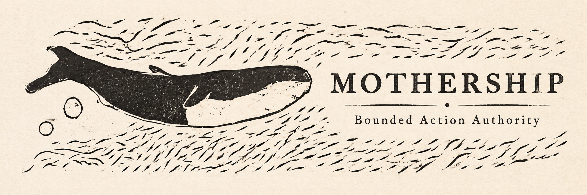
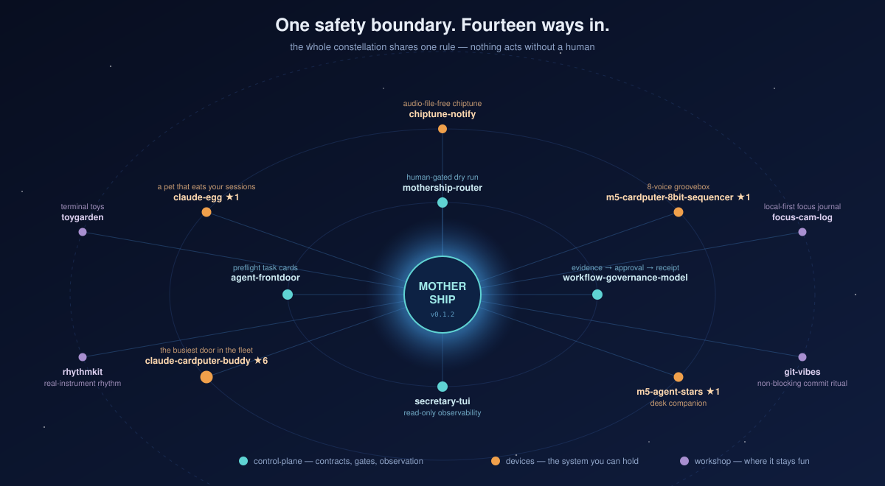

<p align="center">
  
</p>

# Mothership

The black box for AI agents.
Know what your agents were allowed to do—and prove what actually happened.

<p align="center">
  
  
  
  
</p>

Mothership is a local, human-governed control plane that verifies supplied evidence. It records no ambient state,
launches no agent, and creates no authority.

[日本語](docs/ja/README.md) · [Architecture](docs/architecture.md) · [Install](docs/installation.md) ·
[Protocols](docs/protocols.md) · [Security](docs/security.md) · [Flight Recorder design](docs/superpowers/specs/2026-08-12-mothership-flight-recorder-design.md)

<p align="center">
  
</p>

## See agent scope drift in 60 seconds

Two credential-free fixtures exercise the verifier. The first establishes that every required supplied record links
cleanly; the second establishes a scope mismatch. These are generated by the real CLI, not hand-written examples.

<!-- flight-safe-output:start -->
```json
{"authority_effect":false,"claim":"supplied-records-only","execution_effect":false,"required_stages":8,"rule_ids":[],"run_id":"flight-safe-001","scenario":"safe","schema_version":"mothership.flight-demo.v1","verdict":"COMPLETE","verified_stages":8}
```
<!-- flight-safe-output:end -->

<!-- flight-drift-output:start -->
```json
{"authority_effect":false,"claim":"supplied-records-only","execution_effect":false,"required_stages":8,"rule_ids":["FLIGHT.DRIFT.ACTION_CLASS"],"run_id":"flight-drift-001","scenario":"drift","schema_version":"mothership.flight-demo.v1","verdict":"DRIFTED","verified_stages":8}
```
<!-- flight-drift-output:end -->

`COMPLETE` means the supplied safe-run evidence is complete and linked. `DRIFTED` means the supplied record proves an
execution action class exceeded the approval. The remaining closed verdicts are `INCOMPLETE` for absent required
evidence and `INVALID` for malformed, substituted, or contradictory evidence.

The generated [safe-run report](docs/generated/flight-safe-report.md) ends with the boundary that applies throughout:
“This report verifies supplied records; it does not grant authority or prove unobserved real-world actions.”

## What Mothership proves

For an explicitly supplied run, Mothership evaluates five linked questions:

1. What was requested?
2. What scope and action class were allowed?
3. What execution receipt was supplied?
4. What result evidence and verification support the claim?
5. What persistence proof supports the completed run?

It detects mismatches in the evidence graph. It does not stop a rogue agent, universally enforce permissions, or prove
anything that was never observed and supplied to the verifier.

## The flight lifecycle

The canonical lifecycle is ordered as follows:

```text
Intent
  -> Scope
  -> Decision
  -> Approval binding
  -> Execution receipt
  -> Result evidence
  -> Verification
  -> Persistence proof
  -> Reusable asset (optional)
```

The minimum complete run ends at persistence proof. Observation is a projection over a stage or a whole run, not a final
stage that implies execution completed.

## Quick start

From a source checkout, run this clone-first sequence:

<!-- quickstart:start -->
```sh
python3 -m venv .venv
. .venv/bin/activate
python -m pip install .
mothership verify
mothership demo safe
```
<!-- quickstart:end -->

Installation may need locally available build tooling. The installed package has zero runtime dependencies; the
verification and safe demo run offline. A successful check does not grant permission to execute work.

## Import and verify a run

The only shipped importer is Generic JSONL. It reads a named source and writes only to the output you name:
`mothership import generic events.jsonl --out ./flight-001`. Then evaluate the supplied bundle with
`mothership verify run ./flight-001`, inspect its causal projection with `mothership replay ./flight-001`, or render a
derived report with `mothership report ./flight-001 --format markdown`.

Import, verify, replay, and report do not invoke an agent, run a recorded action, search a home directory, retry failed
work, or repair input. See [installation](docs/installation.md) for the exact effects of each command.

## Authority as Data

Intent, scope, decision, approval binding, execution receipt, result evidence, verification, and persistence proof are
explicit linked records. A valid record is evidence about its stated subject; it is never a new permission grant.

The verifier recomputes its verdict from the bundle. `INVALID` takes precedence over `DRIFTED`, which takes precedence
over `INCOMPLETE`, which takes precedence over `COMPLETE`.

## Safety guarantees

- Every public Flight command uses an explicit path; there is no ambient capture or directory discovery.
- `metadata-only` stores only metadata. `portable-evidence` accepts explicitly selected artifacts after secret and
  private-path checks.
- Secret-like keys, credentials, environment dumps, raw prompt bodies, private absolute paths, and unsupported binary
  content are rejected or require redaction.
- Verification, replay, and report are read-only. Report output goes only to standard output.
- The verifier does not repair, retry, fall back, or make a continuation decision.

See the [security model](docs/security.md) for residual risks, including false or omitted source records.

## What Mothership is not

- Not an autonomous agent runtime, model router, or model launcher.
- Not a permission grant, enforcement plugin, or third-party runtime integration.
- Not a credential manager, prompt archive, environment collector, or home-directory copier.
- Not a scheduler, hook installer, daemon, deployment system, retry engine, or repair service.
- Not a certification by OWASP, NIST, a vendor, or a model provider.

## Architecture

Mothership owns flight-bundle composition, run verdicts, replay, and presentation. Existing companions retain their
semantic ownership and remain independently adoptable.

| Lifecycle responsibility | Existing owner | Mothership responsibility |
| --- | --- | --- |
| Intent and bounded scope | Agent Frontdoor | Reference and validate task artifacts |
| Evidence and approval semantics | Workflow Governance Model | Reuse frozen semantics |
| Approval-bound selection | Mothership Router | Verify the binding in a run |
| Worker and team events | Agent Team Runtime | Import compatible explicit events only |
| Append-only evidence | Evidence Spine Core | Reference and verify records |
| Cross-run relationships | Run Lineage Core | Project lineage into replay and reports |
| Composition and verdict | Mothership | Evaluate the whole supplied run |

The broader constellation is conceptual, not an installed dependency, an authority grant, or an automatic integration.

<p align="center">
  
</p>

Read the [architecture](docs/architecture.md) for the v0.3 graph and its v0.2 compatibility projection.

## Public API

The stable public command surface includes `import generic`, `verify run`, `replay`, `report`, `demo safe`, and
`demo drift`. Library facades for `mothership.scope`, `mothership.approval`, `mothership.adapters`,
`mothership.contracts`, and `mothership.protocols` remain available for v0.2 compatibility.

## Ecosystem protocols

The v0.2 protocol demo remains supported as a compatibility projection, not a completed real-world lifecycle:
`frontdoor-task` -> `governance-handoff` -> `router-manifest` -> `observation-snapshot`.

| Protocol kind | Version | Semantic owner |
| --- | --- | --- |
| `frontdoor-task` | `intake.v0` | [Agent Frontdoor](https://github.com/UMEBOSHIISAN/agent-frontdoor) |
| `governance-handoff` | `1.1` | [Workflow Governance Model](https://github.com/UMEBOSHIISAN/workflow-governance-model) |
| `router-manifest` | `1.0` | [Mothership Router](https://github.com/UMEBOSHIISAN/mothership-router) |
| `observation-snapshot` | `1.0` | [Secretary TUI](https://github.com/UMEBOSHIISAN/secretary-tui) |

The compatibility projection validates supplied protocol documents. Its `authority_effect: false` and
`execution_effect: false` fields do not describe the Flight approval or execution events.

## Compatibility

Mothership requires Python 3.12+ and has zero runtime dependencies. The measured environment is Python 3.14.6 on macOS;
unmeasured Python, operating-system, package, and adapter forms are not claims of support. The retained `0.2.0`
projection exposes `claude-code-agent`, `codex-cli`, and `ollama-local` diagnostics; only the Ollama detail probe may
query an already installed default loopback daemon. The [compatibility matrix](docs/compatibility.md) separates measured
facts from projections and candidates.

## Documentation

| Need | Document |
| --- | --- |
| Flight bundle model and owners | [Architecture](docs/architecture.md) |
| Index, event, version, and verdict contracts | [Protocols](docs/protocols.md) |
| Explicit I/O, privacy, and residual risk | [Security](docs/security.md) |
| Installation and command effects | [Installation](docs/installation.md) |
| Measured and unmeasured environments | [Compatibility](docs/compatibility.md) |
| Shipped and candidate adapters | [Roadmap](docs/ecosystem-roadmap.md) |
| Design boundaries | [Flight Recorder design](docs/superpowers/specs/2026-08-12-mothership-flight-recorder-design.md) |

## Contributing

See [CONTRIBUTING.md](CONTRIBUTING.md). New behavior starts with a failing test. Public claims need executable evidence
or an explicit limitation; protocol semantics stay with their owners.

## Security

Read [SECURITY.md](SECURITY.md) before reporting a vulnerability. Do not include credentials, private paths, personal
data, or exploit details in a public issue.

## Roadmap

The [ecosystem roadmap](docs/ecosystem-roadmap.md) records shipped Generic JSONL import and keeps vendor adapters as
candidates. No adoption number, platform coverage, or certification is implied.

## License

Mothership is released under the [MIT License](LICENSE).
