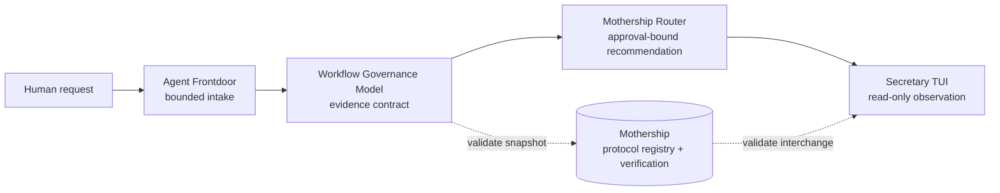

<p align="center">
  
</p>

# Mothership

<p align="center"><strong>The portable, safety-first control plane for AI coding environments.</strong></p>

<p align="center">
  
  
  
  
  
</p>

<p align="center"><strong>Move the control plane. Keep secrets and authority local.</strong></p>

Mothership packages the contracts, protocol snapshots, integrity checks, and local diagnostics that make an AI coding
setup inspectable across machines. It does not invoke a model, select an executor, or turn a recommendation into
permission.

[日本語](docs/ja/README.md) · [Architecture](docs/architecture.md) · [Install](docs/installation.md) ·
[Protocols](docs/protocols.md) · [Security](docs/security.md) · [Research evidence](docs/research/paper-evidence.md)

## Quick start

From a Mothership source checkout, the complete first-run path is five commands:

<!-- quickstart:start -->
```sh
python3 -m venv .venv
. .venv/bin/activate
python -m pip install .
mothership verify
mothership demo
```
<!-- quickstart:end -->

Installation may obtain build tooling. The installed runtime has zero third-party dependencies, and `verify` plus
`demo` run offline. A successful result validates the artifact; it grants no authority to execute work.

<p align="center">
  
</p>

## See the whole control plane in 60 seconds

`mothership demo` validates one fictional document at every boundary and emits this deterministic result:

<!-- demo-output:start -->
```json
{"authority_effect":false,"capability":"code-review","claim":"protocol-composition-only","execution_effect":false,"schema_version":"mothership.demo.v1","stages":[{"kind":"frontdoor-task","schema_version":"intake.v0","valid":true},{"kind":"governance-handoff","schema_version":"1.0","valid":true},{"kind":"router-manifest","schema_version":"1.0","valid":true},{"kind":"observation-snapshot","schema_version":"1.0","valid":true}],"status":"passed","task_id":"demo-review-001"}
```
<!-- demo-output:end -->

That output means four versioned protocol documents composed successfully. It does not mean an agent ran, a human
approved anything, or a real task completed.

## The problem

AI coding setups accrete invisible state: a CLI here, a local model there, a useful alias, a policy file, and one more
machine-specific convention. Copying the whole home directory is quick but leaks too much. Rebuilding from memory is
safer but loses the exact boundaries that made the setup trustworthy.

The hard part is not moving binaries. It is preserving the distinction between:

- what can be shared;
- what must remain local;
- what is only a recommendation;
- what needs explicit human authority;
- what evidence proves the handoff stayed inside those boundaries.

## The Mothership answer

Mothership makes those distinctions executable and reviewable:

- an installable Python package and one `mothership` command;
- strict JSON contracts and fail-closed local file loading;
- a frozen registry for four independently owned ecosystem protocols;
- a deterministic synthetic chain that proves composition without execution;
- resource digests and an offline installation-integrity check;
- compatibility facades for scope, approval-ledger, adapter, and contract primitives;
- a reproducible evaluation corpus with explicit claim limits.

The governing rule is simple: **share structure; keep credentials, selection, and execution authority local.**

## Architecture

Mothership is the hub for installation, verification, and protocol compatibility. The focused companions stay useful on
their own and retain their own release histories.



No arrow is an implicit process launch. Mothership neither discovers nor installs companions. It validates explicitly
supplied data against frozen compatibility snapshots.

| Layer | Owns | Never implies |
| --- | --- | --- |
| Agent Frontdoor | bounded task-card intake | worker invocation |
| Workflow Governance Model | evidence and authority relationships | approval |
| Mothership Router | human-gated dry-run recommendation | execution |
| Secretary TUI | explicitly supplied local observation | freshness |
| Mothership | package, protocols, integrity, composition | ambient authority |

Read the full [architecture](docs/architecture.md) and [composition guide](docs/composition.md).

## Choose your adoption path

### 1. Mothership alone — recommended first step

Install the hub, run `mothership verify`, inspect `mothership protocol list`, and use diagnostics intentionally. You get
the portable control-plane primitives without requiring any companion.

### 2. Add one focused companion

Adopt Agent Frontdoor, Workflow Governance Model, Mothership Router, or Secretary TUI independently. Pass its explicit
interchange document to `mothership protocol validate KIND FILE` when you want suite-level compatibility evidence.

### 3. Validate the full synthetic chain

Run `mothership demo` to validate all four bundled documents and their transitions. The chain remains synthetic and
read-only; launching real work is deliberately outside this product.

## Safety guarantees

For the public `mothership` CLI surface:

- `verify`, `protocol`, and `demo` are read-only and operate on packaged or explicitly named local data;
- JSON rejects duplicate keys, non-finite numbers, malformed UTF-8, unknown fields, and unsupported versions;
- explicit protocol files must be normalized absolute paths to bounded regular files with no symlink traversal;
- valid documents do not become approval, selection, execution, or proof of task completion;
- no command installs a companion, invokes a model, reads credentials, retries, or creates background services;
- Mothership directs no external network traffic at runtime;
- `doctor ollama-local` may query an already installed Ollama daemon on its default loopback interface.

Existing library APIs can write only when a programmer explicitly supplies a target for bounded staging or approval
ledger events. Those calls are not implicit side effects of the default CLI. See the [security model](docs/security.md).

## What Mothership is not

- Not an autonomous agent runtime.
- Not a model router or model launcher.
- Not a secret manager or home-directory copier.
- Not a scheduler, hook installer, daemon, deployment system, or retry engine.
- Not a claim that local diagnostics make an environment safe.
- Not a replacement for human review of the command that eventually performs work.

## How it compares

| Question | Mothership | Copy a home directory | Agent framework | Model router |
| --- | --- | --- | --- | --- |
| Main job | portable control plane | duplicate machine state | run agent workflows | select model traffic |
| Secrets included | no | often possible | configuration-dependent | configuration-dependent |
| Grants authority | no | copies existing state | framework-dependent | usually no |
| Executes work | no | copied tools may | commonly | sends inference requests |
| Offline integrity | built in | manual | framework-dependent | service-dependent |

These are category differences, not a universal ranking. Mothership can sit beside an agent framework or model router
when the operator wants an explicit local control boundary around them.

## Public API

The compatibility modules keep current implementations authoritative while providing stable import paths:

| Module | Purpose |
| --- | --- |
| `mothership.scope` | bounded path validation, measurement, staging, and locking |
| `mothership.approval` | single-use approval-bound attempt evidence |
| `mothership.adapters` | immutable adapter plans and fixed diagnostics |
| `mothership.contracts` | strict JSON, hashing, contract, and registry helpers |
| `mothership.protocols` | inspect and validate ecosystem interchange documents |

Mothership 0.2 keeps the legacy import paths available. A future removal would require a major-version decision.

## Ecosystem protocols

The registry freezes one ordered, non-authorizing chain:

| Protocol kind | Version | Semantic owner |
| --- | --- | --- |
| `frontdoor-task` | `intake.v0` | [Agent Frontdoor](https://github.com/UMEBOSHIISAN/agent-frontdoor) |
| `governance-handoff` | `1.0` | [Workflow Governance Model](https://github.com/UMEBOSHIISAN/workflow-governance-model) |
| `router-manifest` | `1.0` | [Mothership Router](https://github.com/UMEBOSHIISAN/mothership-router) |
| `observation-snapshot` | `1.0` | [Secretary TUI](https://github.com/UMEBOSHIISAN/secretary-tui) |

Mothership owns the frozen composition snapshot, not each companion's domain semantics. Updating a protocol requires a
coordinated owner release, bundled schema, digest, fixture, compatibility table, and conformance test. See the complete
[protocol reference](docs/protocols.md).

## Compatibility

- Declared Python support: Python 3.12+.
- Runtime dependencies: zero.
- File-boundary implementation: POSIX regular-file, descriptor, and no-follow semantics.
- Measured Wave 1 environment: Python 3.14.6 on macOS.
- Diagnostic aliases: `claude-code-agent`, `codex-cli`, and `ollama-local`.
- Frozen suite protocols: four, all non-authorizing and non-executing.
- Effect constants: `authority_effect: false` and `execution_effect: false`.

See the [compatibility matrix](docs/compatibility.md) before assuming support for an unmeasured platform.

### Measured artifact evidence

The tracked evaluator reports 4/4 valid protocol cases accepted, 20/20 synthetic invalid mutations rejected, and one
byte-identical demo output across eight controlled process environments. Agent Frontdoor's public labeled corpus reports
31/31 positive cards valid, 41/41 negative cards with exact issue codes, 16/16 unsafe drift cases detected, and 4/4 safe
controls preserved.

These are internal synthetic-corpus results, not production accuracy. Reproduce them and read the denominators and
limitations in [Paper evidence and claim boundaries](docs/research/paper-evidence.md). The Mothership machine-readable
result is [`evaluation/results/mothership-0.2.0.json`](evaluation/results/mothership-0.2.0.json).

## Documentation

| Need | Document |
| --- | --- |
| Install, update, or remove | [Installation lifecycle](docs/installation.md) |
| Understand trust boundaries | [Architecture](docs/architecture.md) |
| Compose independent projects | [Composition guide](docs/composition.md) |
| Inspect schemas and versions | [Protocol reference](docs/protocols.md) |
| Review threats and residual risk | [Security model](docs/security.md) |
| Check measured support | [Compatibility](docs/compatibility.md) |
| Follow ecosystem direction | [Roadmap](docs/ecosystem-roadmap.md) |
| Read the complete Japanese guide | [日本語ガイド](docs/ja/README.md) |

## Contributing

Start with [CONTRIBUTING.md](CONTRIBUTING.md). Changes to protocols require coordination with the semantic owner. New
behavior starts with a failing test, and public claims must point to an executable check or a bounded evidence record.

## Security

Read [SECURITY.md](SECURITY.md) before reporting a vulnerability. Use GitHub's private security-advisory flow; never put
credentials, private paths, exploit details, or personal data in a public issue.

## Roadmap

Version 0.2 focuses on the installable hub, frozen protocol chain, deterministic demo, evidence, and documentation.
Candidate work is tracked separately from shipped behavior. Automatic execution, companion installation, credential
management, retries, and background services are not planned within the current boundary.

See the [ecosystem roadmap](docs/ecosystem-roadmap.md) for shipped, candidate, and explicitly excluded work.

## License

Mothership is released under the [MIT License](LICENSE).
