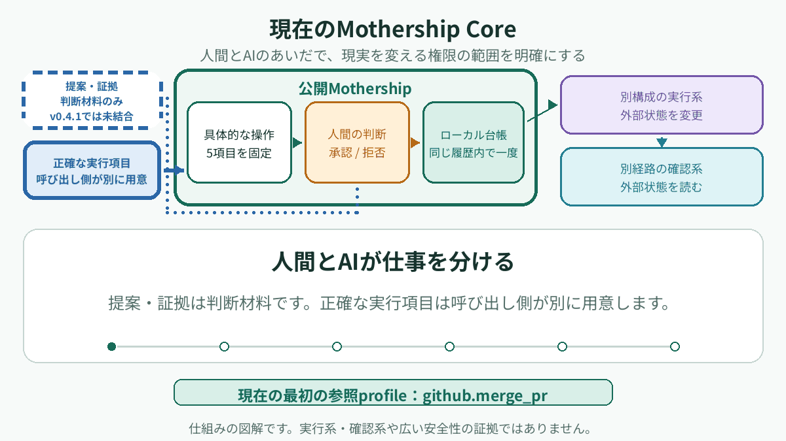
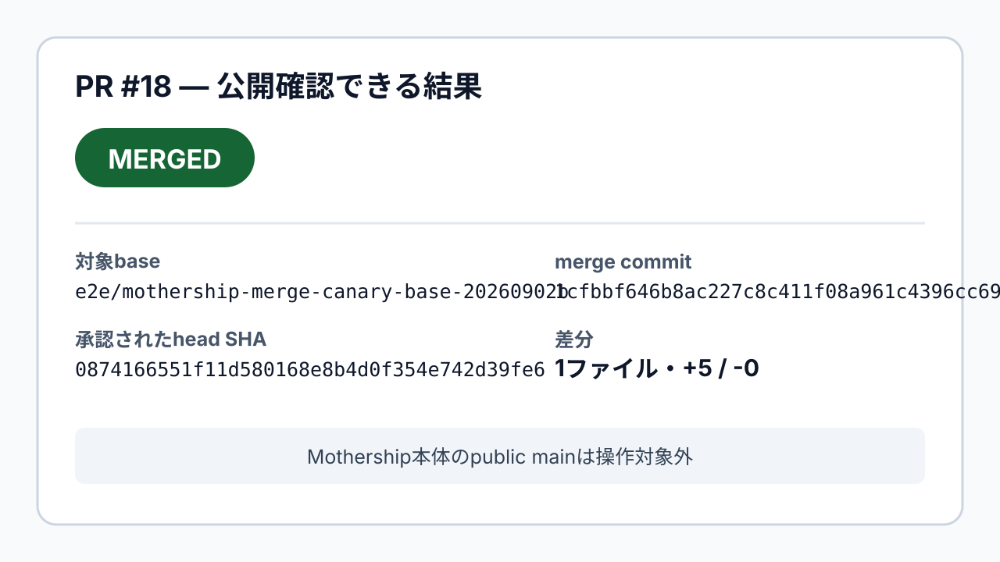
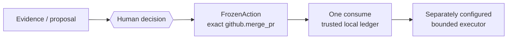

# Mothership

<p align="center">
  
</p>

> AIに「できる」を渡しても、「やってよい」は人間に残す。
>
> ひとつの判断。ひとつの具体的な操作。一度だけ。

Mothershipは、AIの提案と外部操作の境界を扱う、範囲を限定した
Action Authorityのリファレンス実装です。人間が確認したひとつの
具体的な操作を、短い有効期間と一回限りの使用に結び付けます。

これは現場で組み立てたリファレンス実装／実行可能な設計論です。
企業向けの完成品、医療製品、本番向けの権限サービス、汎用的な
エージェントセキュリティ基盤ではありません。

<p align="center">
  
</p>

これは仕組みの図解です。公開パッケージが実行系・確認系を同梱することや、
一般的な安全性を証明するものではありません。動きを止めて読む場合は
[静止画ポスター](assets/readme/ja/mothership-flow-poster.png)を参照してください。

## 現在の公開範囲

公開されているAction profileは `github.merge_pr` のみです。公開パッケージは
AIモデル、実行系、確認結果の生成器、認証情報管理、医療機能を同梱しません。
デフォルトCLIも外部の重要な変更を実行しません。

現在のActionのscopeは次の固定値です。

- repository
- pull request number
- expected head SHA
- expected base branch name
- merge method

repository、PR number、expected head SHA、expected base branch name、
merge methodは固定されます。base commit SHAは結び付けられません。
`expires_at`はaction digestに含まれません。統合側は毎回新しい
`action_id`を発行し、表示した発行情報と期限へ人間の応答を対応付け、
遅延・再利用応答を拒否してください。

人間の本人確認は行いません。一回限りの再利用拒否は、ひとつの
信頼されたローカル台帳履歴に限られます。コピーまたは復元された台帳は
別の再利用範囲です。発行後のプロセスforkも本人確認の代わりにはなりません。

## 公開されている結果

[PR #18の公開結果](docs/evidence/github-merge-pr-e2e-20260903/README.md)では、
隔離されたcanary baseに対するひとつの `github.merge_pr` を記録しています。
公開GitHubのread-backは、対象head SHA、merge commit、親、対象diffを示します。
これはPR #18についての一例です。非公開の全履歴が公開物だけで再現できること、
汎用的な安全性、本番運用への適合は主張しません。

<p align="center">
  
</p>

## 境界モデル



Evidenceとproposalは判断材料です。人間の判断として渡された応答は、
対象操作のdigestと照合されます。`FrozenAction`を一度使用した後の実行系は
別途設定されます。Mothership自身がモデルを呼び出したり、GitHubを
変更したりはしません。

## クイックスタート

<!-- quickstart:start -->
```sh
python3 -m venv .venv
. .venv/bin/activate
python -m pip install .
mothership verify
mothership demo
```
<!-- quickstart:end -->

`mothership verify`は、同梱resource inventory、schema、registry、fixture、
digestをオフラインで検査します。インストール済みの全コード、host、
外部環境の安全性を検査するものではありません。`mothership demo`は
legacy 0.2のsyntheticなprotocol-composition demoです。Authority Coreの
証明でも、agent実行・人間の承認・実タスク完了の証拠でもありません。

## 何を提供するか

- exactな `github.merge_pr` actionをvalidateしてfreezeするAPI
- caller-attested human decisionをaction SHA-256へbindするAPI
- ledger eventを記録し、trusted local ledgerで一度だけconsumeするAPI
- strict JSON contract、compatibility registry、同梱資料とfixtureのオフライン検査
- legacy 0.2 protocolのread-only validationとsynthetic demo

Decision Approval（review evidence）とAction Authority Decision（consequential authority）は別物です。
Decision Cardが自動的にFrozenActionになることはありません。callerが
exact parametersを別途渡します。

## コードツアー

- [`orchestration/lib/action_authority.py`](orchestration/lib/action_authority.py) — 操作の固定と判断の照合
- [ledger implementation](orchestration/lib/action_authority_ledger.py) — 台帳への追記と一回限りの使用
- [external-action contracts](orchestration/lib/external_action.py) — 結果報告と独立確認の記録形式
- [`tests/test_action_authority.py`](tests/test_action_authority.py) — Authority Coreの境界テスト
- [ledger tests](tests/test_action_authority_ledger.py) — 再利用と台帳履歴のテスト
- [external-action tests](tests/test_external_action_contracts.py) — 外部操作の記録形式のテスト

## 現在の制約

| 項目 | 公開実装が言えること | 言えないこと |
| --- | --- | --- |
| identity | caller-attested decisionを保持する | human identityの認証 |
| replay | ローカル台帳履歴内で一回使用 | 台帳コピー／復元をまたぐ全体の再利用防止 |
| action scope | `github.merge_pr`の5つのexact parameterを固定 | base commit SHAのbind、任意operation |
| expiry | 短いTTLを表示・検査する | `expires_at`をdigestへbindすること |
| execution | 別executorへ渡すdataを返す | live executor、credential、retry、daemon |
| verification | 独立recordのshapeとbindingを検査する | verifierのidentityやread-only動作を保証する |
| package check | 同梱inventoryとdigestを検査する | host／全インストールコード／外部安全性 |
| public result | PR #18の一bounded result | generic safety、production readiness、private trace再現性 |

## 事故から生まれた境界

この設計には、実際の運用事故から得た短い教訓があります。人間が21ファイルの
削除を承認した後、実行時のpattern展開で94ファイルが削除されました。
承認は本物でも、承認対象の集合が固定されていませんでした。そこで、見えていない
fieldや対象を黙って吸収せず、閉じた操作範囲として拒否します。

もう一つの教訓は、tool callの失敗を確認しないまま、もっともらしい
success summaryを出してしまったことです。このため、labelをevidenceと扱わず、
実行側の結果報告と外部状態の独立確認を分け、不明なら停止します。

## 0.2 compatibility

Frontdoor、WGM、Router、Secretaryのprotocolは、相互運用性と履歴のための
legacy surfaceです。現在のAuthority Coreの実行経路ではありません。
`mothership demo`は同梱された4つのfictional documentをオフラインで検査します。
companionをdiscover、install、実行する機能はありません。

## 関連ドキュメント

- [Architecture](docs/architecture.md)
- [Installation](docs/installation.md)
- [Protocols](docs/protocols.md)
- [Security model](docs/security.md)
- [Composition guide](docs/composition.md)
- [0.2互換protocolの履歴](docs/legacy/compatibility-0.2.md)
- [English README](README.en.md)

## License

MIT. 詳細は [LICENSE](LICENSE) を参照してください。
