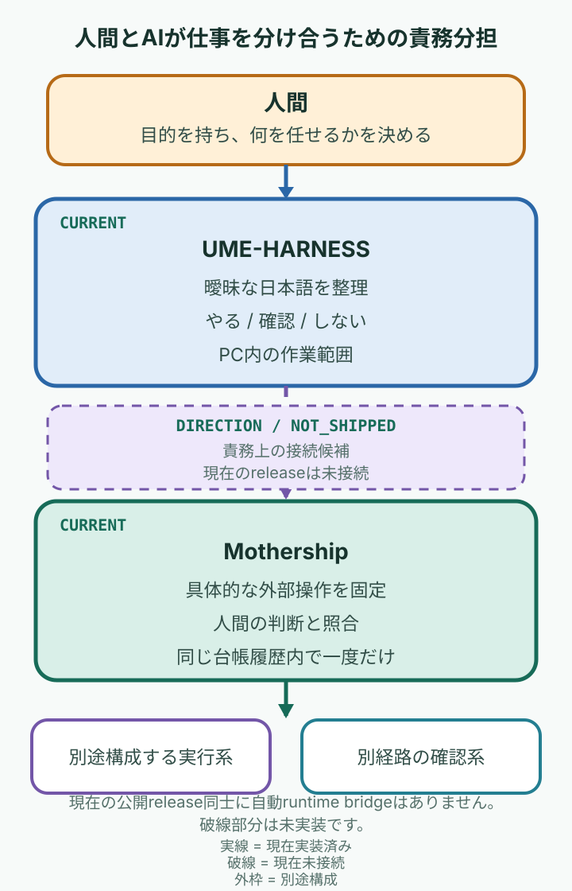

# Mothership

[English](README.en.md) · [v0.4.1](https://github.com/UMEBOSHIISAN/mothership/releases/tag/v0.4.1) ·
[CI](https://github.com/UMEBOSHIISAN/mothership/actions)

<p align="center">
  
</p>

> 人間が全部を抱えず、AIにも全部を明け渡さない。
>
> 人間とAIが仕事を分け合うために、
> 「どこまで任せるか」を曖昧にしない。

Mothershipは、AIが関わる仕事で
現実を変える権限を限定的に受け渡すための
オープンソース・リファレンス実装です。

対応済みの具体的な操作を固定し、
人間の判断と照合して、
同じ信頼されたローカル台帳履歴の中で一度だけ取り出せるようにします。

Mothership自身は、仕事を選ばず、AIモデルを動かさず、
外部操作も実行しません。

## PURPOSE

人間とAIが仕事を分け合うには、「できる」と「やってよい」を分ける必要があります。
Mothershipは、AIを止めることではなく、人間が具体的な仕事を安心して任せられるように、
その受け渡しを曖昧にしないことを目指します。

| 区別 | 意味 |
| --- | --- |
| Capability | AIやツールに何ができるか |
| Authority | そのうち何をしてよいか |
| Decision | 人間が今回どこまで任せると決めたか |
| Execution | 現実にどの操作が行われたか |

安全性は製品カテゴリーではなく、これらを混ぜずに扱うための成立条件です。

## 責務分担

UME-HARNESSは、人間の意図を範囲の決まったローカル作業へ整理します。
Mothershipは、人間の判断を範囲の決まった外部結果へ結び付けます。

<p align="center">
  
</p>

これは責務分担の方向を示す図です。現在の公開release同士に自動runtime bridgeはありません。破線部分は未実装です。
外部の実行系と確認系も別途構成します。

## CURRENT: v0.4.1

現在の公開実装が提供するのは、ひとつの対応済み外部操作を固定し、
caller-attestedな人間の判断と照合し、ローカル台帳へ記録して一度だけ取り出す境界です。

実装済み:

- 対応済み操作パラメータの検証と `FrozenAction` への固定
- approve / rejectとaction ID・digestの照合
- decision eventのローカル台帳への記録
- 同じ信頼されたローカル台帳履歴での一回限りのconsume
- executorのReceiptと別経路Verificationを分けるclosed contract

現在含まないもの:

- UME-HARNESSとのruntime bridge
- 汎用executor、verifier producer、credential manager、retry、daemon
- human identity authentication
- 任意operationや自動実行

proposalとevidenceは判断材料ですが、FrozenActionへ機械的に結び付けられません。
Mothershipは、対応済みの実行パラメータを別に受け取り、それを先にfreezeします。

## 現在のMothership Core

<p align="center">
  
</p>

これは仕組みの図解です。GIFそのものは実行証拠ではありません。
動きを止めて読む場合は[静止画ポスター](assets/readme/ja/mothership-flow-poster.png)を参照してください。

対応済みの実行パラメータを固定してから、人間の判断として渡された応答を
action IDとdigestへ照合し、判断eventを記録します。同じaction IDのconsumeは、
ひとつの信頼されたローカル台帳履歴内で一度だけです。

## 現在の参照profile

最初のcurrent reference profileは `github.merge_pr` です。
これはMothershipの用途全体ではなく、権限の受け渡しを具体的に閉じた最初の実装例です。

現在固定する値:

- repository
- pull request number
- expected head SHA
- expected base branch name
- merge method

base commit SHAは結び付けられません。`expires_at`はaction digestに含まれません。

## 公開結果の一例

[PR #18の公開結果](docs/evidence/github-merge-pr-e2e-20260903/README.md)は、
隔離されたcanary baseに対するひとつの `github.merge_pr` を記録した一例です。
公開GitHubのread-backから、対象head SHA、merge commit、親、対象差分量を確認できます。

<p align="center">
  
</p>

これはPR #18に限った公開結果です。非公開の全履歴を公開物だけで再現できること、
汎用的な安全性、本番運用への適合は主張しません。

## クイックスタート

<!-- quickstart:start -->
```sh
python3 -m venv .venv
. .venv/bin/activate
python -m pip install .
mothership verify
mothership demo
```
<!-- quickstart:end -->

`mothership verify`は、同梱resource inventory、schema、registry、fixture、digestを
オフラインで検査します。host、外部環境、インストール済みの全コードの安全性を検査するものではありません。

`mothership demo`はlegacy 0.2のsyntheticなprotocol-composition demoです。
Authority Coreの証明でも、agent実行、人間の承認、実タスク完了の証拠でもありません。

## 現在の制約

| 項目 | v0.4.1で実装していること | 実装・認証していないこと |
| --- | --- | --- |
| identity | caller-attested decisionを保持 | 人間の本人確認は行いません |
| decision event | 同じactionへ複数のdecision eventを記録できる | 一つのterminal decision、supersede、revoke |
| consume | 同じaction IDは同じ台帳履歴内で一度だけconsumeできる | コピー・復元した台帳をまたぐglobal replay防止 |
| action scope | `github.merge_pr`の5つのexact parameterを固定 | base commit SHAのbind、任意operation |
| expiry | 短いTTLを表示・検査 | `expires_at`をaction digestへbind |
| execution | 別executorへ渡すdataを返す | live executor、credential、retry、daemon |
| verification | ReceiptとVerificationのshape・bindingを検査 | verifier producerのidentityやread-only動作 |
| package check | 同梱inventoryとdigestを検査 | host、全インストールコード、外部安全性 |
| public result | PR #18のbounded result | generic safety、production readiness、private trace再現性 |

本実装は、本番運用または規制対象の高リスク用途への適合を認証するものではありません。
一回限りの再利用拒否は、ひとつの信頼されたローカル台帳履歴に限られます。

## 詳細ドキュメント

### コードツアー

- [`orchestration/lib/action_authority.py`](orchestration/lib/action_authority.py) — 操作の固定と判断の照合
- [ledger implementation](orchestration/lib/action_authority_ledger.py) — 台帳への追記と一回限りの使用
- [external-action contracts](orchestration/lib/external_action.py) — 結果報告と独立確認の記録形式
- [`tests/test_action_authority.py`](tests/test_action_authority.py) — Authority Coreの境界テスト
- [ledger tests](tests/test_action_authority_ledger.py) — 再利用と台帳履歴のテスト
- [external-action tests](tests/test_external_action_contracts.py) — 外部操作の記録形式のテスト

### 背景と互換性

この境界は、承認時に見た対象と実行時の対象がずれた運用事故、および未確認のtool failureを
success summaryとして扱った事故から学んでいます。labelをevidenceとして扱わず、不明なら停止します。

Frontdoor、WGM、Router、Secretaryのprotocolはlegacy 0.2互換と履歴のために残しています。
現在のAuthority Core実行経路ではありません。

### リファレンス

- [Architecture](docs/architecture.md)
- [Installation](docs/installation.md)
- [Protocols](docs/protocols.md)
- [Security model](docs/security.md)
- [Composition guide](docs/composition.md)
- [0.2互換protocolの履歴](docs/legacy/compatibility-0.2.md)
- [English README](README.en.md)

## License

MIT. 詳細は [LICENSE](LICENSE) を参照してください。
