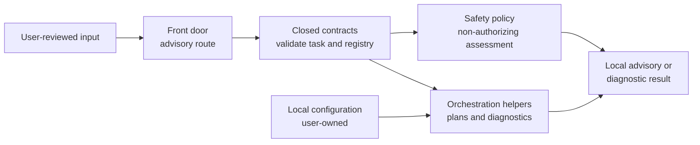

# Mothership

> **日本語の導入ガイド:** [docs/ja/README.md](docs/ja/README.md)


Mothership is a safe, local foundation for reviewing and distributing an AI-assisted development harness. It provides closed contracts, advisory routing, local diagnostic helpers, and configuration templates—without granting authority or performing external actions for you.

## Why Mothership?

- **Portable foundation.** Start from a small, inspectable repository instead of copying a personal working directory.
- **Explicit boundaries.** Advisory routing can recommend an eligible alias but never selects an executor or launches a model.
- **Local diagnostics.** Check whether documented local adapter commands are available without installing, authenticating, or invoking them.
- **Closed contracts.** JSON contracts reject undocumented fields and unsafe shapes early.
- **Safe configuration defaults.** The bundled example contains no commands, paths, endpoints, access tokens, or credentials.
- **Easy verification.** The full test suite runs locally with the Python standard library.

## What it is not

Mothership does **not** install hooks, alter editor or Codex settings, manage credentials, deploy software, choose work, approve actions, start retries, or send requests to a model. It is a foundation to review and adapt locally—not a service manager or an autonomous agent.

## Architecture at a glance



The data flow is local and explicit: validated input may produce an advisory result or a diagnostic report. Any authority, credentials, execution, or operational decision remains outside Mothership and with the user.

For the component-level view, see [Architecture](docs/architecture.md).

## Quick start

### 1. Clone and check your runtime

Mothership supports Python **3.12 or later**.

```sh
git clone https://github.com/UMEBOSHIISAN/mothership.git
cd mothership
python3 --version
```

### 2. Run a local diagnostic

```sh
./bootstrap/doctor.sh
```

This only checks the documented local adapter commands. A non-zero status simply means one or more adapters are unavailable; it does not install anything, authenticate, invoke a model, change settings, or contact a service.

### 3. Verify the package

```sh
python3 -m unittest discover -s tests -v
```

## Configuration

[`config/executors.example.json`](config/executors.example.json) is deliberately empty of operational details. If you choose to make a local configuration, copy the example to a location you control and review every command array yourself. Do not commit credentials, machine-specific paths, or personal data.

Read [Installation and lifecycle](docs/installation.md) before adapting the configuration.

## Guides

| Guide | What it covers |
| --- | --- |
| [Architecture](docs/architecture.md) | Components, contracts, data flow, and authority boundary |
| [Installation and lifecycle](docs/installation.md) | Requirements, setup, diagnostics, verification, updates, removal, and troubleshooting |
| [Security model](docs/security.md) | Secrets, local ownership, and deliberate non-goals |
| [Japanese introduction](docs/ja/README.md) | 日本語での短い導入と安全な始め方 |

## Updating and removal

To update, obtain a newer tagged release, review its changelog and checksum manifest, then replace or reclone the package and rerun the test suite. Mothership has no in-place updater.

To remove it, delete the cloned directory. It does not create hooks, settings changes, or managed credentials that need a separate cleanup step.

## License

Mothership is released under the [MIT License](LICENSE).
