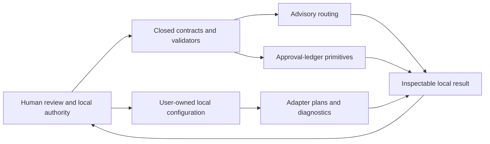
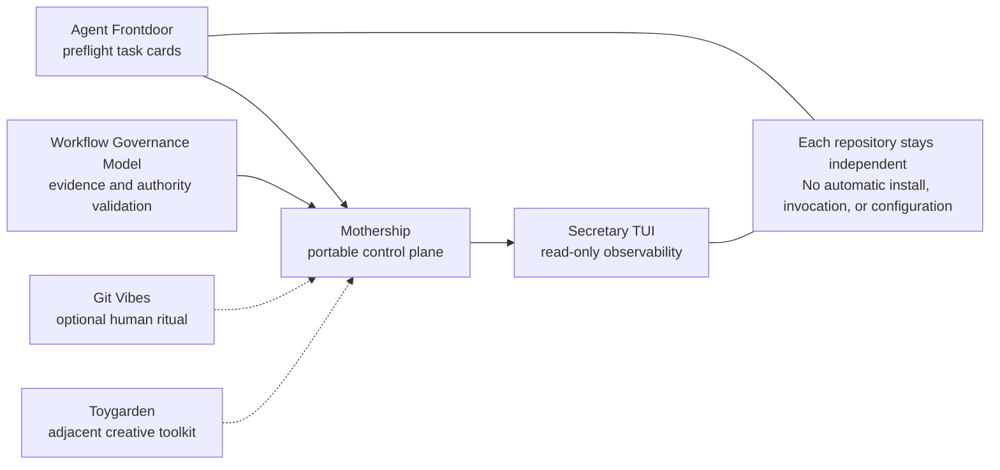

# Mothership

<p align="center">
  
</p>

> **A safety-first control plane for portable AI coding environments.**
>
> Ship your AI coding cockpit — not your secrets.

<p align="center">
  
</p>

[日本語で読む](docs/ja/README.md) · [Architecture](docs/architecture.md) · [Installation](docs/installation.md) · [Security model](docs/security.md) · [Composition guide](docs/composition.md) · [Ecosystem roadmap](docs/ecosystem-roadmap.md)

Mothership is a local, reviewable foundation for building an AI coding environment that can be recreated across machines. It gives Codex CLI, Claude Code, and Ollama Local a common safety layer: closed contracts, fail-closed validation, advisory routing, approval-ledger primitives, local diagnostics, and configuration templates.

It does not make decisions for you, run a model for you, or copy your private machine wholesale. It gives you the control plane to decide what can travel, what must stay local, and what needs human approval.

## The problem

AI coding environments tend to grow organically: a CLI here, a local model there, a useful hook, a shell alias, a project-specific convention. They work wonderfully on one machine—until you need to set up a new Mac, help a teammate, move work to a dedicated mini machine, or rebuild after a clean install.

Copying a whole home directory is fast but unsafe. Rebuilding everything from memory is safe but slow. Mothership sits in the middle: package the contracts, diagnostics, templates, and evidence shapes that make an environment intelligible, then keep credentials, private paths, and execution authority with the operator.

## Capabilities

| Capability | What Mothership provides | Why it matters |
| --- | --- | --- |
| **Closed contracts** | Public JSON contracts for tasks, decisions, registries, invocations, assessments, and approval events | Undocumented fields and unsafe shapes are rejected instead of silently drifting |
| **Fail-closed validation** | Contract and path checks stop on malformed or unsafe input | A broken boundary does not become an accidental permission grant |
| **Advisory routing** | A local route can recommend an eligible alias while leaving selection and execution unset | Guidance stays separate from authority |
| **Approval-ledger primitives** | Canonical, durable event primitives for approval and attempt lifecycle evidence | Approval can be represented as inspectable data instead of hidden state |
| **Adapter plans and diagnostics** | Fixed aliases with immutable plan helpers and a sanitized local diagnostic | You can inspect local tool availability without launching a model |
| **Portable configuration templates** | Deliberately blank examples and checksum-backed release contents | Start from a safe review surface instead of a copied personal config |
| **Local verification** | A standard-library test suite and package checks | A rebuilt environment can prove its foundation before use |

## Portable by design

Mothership is designed around a simple rule: **share the structure; keep the authority local.**

| Travels with the package | Stays with the operator |
| --- | --- |
| Contracts and schemas | Credentials and API keys |
| Safety rules and path guards | Personal paths and shell history |
| Adapter aliases and diagnostic shape | Installed models and execution choices |
| Example configuration templates | Real command arrays and local endpoints |
| Tests, documentation, checksums, and licenses | Approval, deployment, and external side effects |

That distinction makes the package useful for handoff without turning it into an unsafe archive of someone's machine.

## Where it helps

### New machine

Start from a known contract set and test suite instead of recreating the invisible parts of an AI coding setup from memory.

### Teammate handoff

Give someone a safe, documented base they can inspect and configure locally—without sending secrets, personal paths, or a hidden pile of hooks.

### Dedicated mini machine

Put the same control foundation beside local models or worker CLIs, while keeping the actual model installation and permissions specific to that machine.

### Reproducible rebuild

Use tagged source, checksums, and local tests to establish that a rebuilt foundation matches what you intended to distribute.

## Compatibility surface

Mothership includes fixed public aliases for the following local CLI surfaces. These are **diagnostic and planning aliases**, not automatic integrations or launch commands.

| Alias | Intended local surface | What Mothership can do |
| --- | --- | --- |
| `claude-code-agent` | Claude Code | Build and validate a local plan; inspect documented command availability |
| `codex-cli` | Codex CLI | Build and validate a local plan; inspect documented command availability |
| `ollama-local` | Ollama | Build and validate a local plan; inspect documented command availability |

No alias receives credentials, starts a model, or performs work merely because it appears in a result.

## Quick start

### 1. Clone the control plane

Mothership requires Python **3.12 or later**.

```sh
git clone https://github.com/UMEBOSHIISAN/mothership.git
cd mothership
python3 --version
```

### 2. Inspect your local surface

```sh
./bootstrap/doctor.sh
```

`doctor.sh` checks fixed local adapter commands in a sanitized environment. It does not install software, authenticate, edit settings, make a network request, or invoke a model. A non-zero exit status means an adapter is unavailable locally; it is a diagnostic result, not a request to install anything.

### 3. Verify the foundation

```sh
PYTHONDONTWRITEBYTECODE=1 python3 -m unittest discover -s tests -v
```

Run the suite before adapting the package to a machine. A green test run proves the shipped foundation; it does not authorize any later external action.

For the full lifecycle, read [Installation and lifecycle](docs/installation.md).

## How the control plane fits together



Every arrow returns to the operator. Mothership can validate, describe, and record bounded state; it deliberately does not cross the boundary into execution or authority.

## Composable ecosystem

Mothership is stronger when combined with other focused tools. These projects are **independently adoptable**: the diagram describes an architectural relationship, not an installed dependency, automatic setup, or runtime integration.



| Role | Repository | How it composes |
| --- | --- | --- |
| **Preflight boundary** | [Agent Frontdoor](https://github.com/UMEBOSHIISAN/agent-frontdoor) | Turns an informal request into a bounded, fail-closed task card before any downstream system acts |
| **Governance layer** | [Workflow Governance Model](https://github.com/UMEBOSHIISAN/workflow-governance-model) | Validates portable evidence and authority trails; its candidate recommender is advisory and never executes work |
| **Portable control plane** | **Mothership** | Holds the common contracts, advisory routing, diagnostics, and authority boundary |
| **Read-only observability** | [Secretary TUI](https://github.com/UMEBOSHIISAN/secretary-tui) | Presents local operational state without changing it |
| **Human-friendly rituals** | [Git Vibes](https://github.com/UMEBOSHIISAN/git-vibes) | Adds non-blocking commit feedback outside the control plane |
| **Agent-system exploration** | [Toygarden](https://github.com/UMEBOSHIISAN/toygarden) | A terminal-native creative toolkit with agent-facing visualization and composition ideas |

You can use only Mothership, or compose the projects deliberately: validate a task at the front door, retain portable control boundaries in Mothership, observe local state in a read-only TUI, and keep the human experience playful without making it a gate.

## Safe configuration workflow

[`config/executors.example.json`](config/executors.example.json) intentionally contains empty command arrays. It is a review template, not a ready-to-run launcher.

1. Copy it to a location you control.
2. Review every command and path before adding it.
3. Keep tokens, credentials, private data, and machine-specific paths out of Git.
4. Treat execution, deployment, and approval as separate human decisions.

Mothership does not install hooks, modify Codex or Claude Code settings, manage credentials, start retries, or alter your environment.

## What Mothership does not do

Being explicit here is a feature, not a limitation.

- It does not automatically copy an entire environment from one machine to another.
- It does not invoke Claude Code, Codex CLI, Ollama, or any model.
- It does not choose a model, select an executor, or grant authority.
- It does not create hooks, daemons, schedulers, deployments, or background services.
- It does not read, store, transmit, or generate credentials.
- It does not replace review of the actual commands a machine will run.

## Frequently asked questions

### Is Mothership Codex-only?

No. The packaged aliases cover Claude Code, Codex CLI, and Ollama Local. Mothership is a common local control foundation; it does not depend on one vendor's runtime.

### Does it run my models or agents?

No. It can validate a plan, produce an advisory result, or report local command availability. Launching a model or an agent remains a separate choice outside Mothership.

### Do secrets travel with the package?

No. The shipped configuration example contains no commands, paths, endpoints, or access material. Credentials belong only in the operator's local environment.

### Is this an automatic environment copier?

No. It is the reviewable foundation for a reproducible handoff. It packages the structure that should be shared and makes local-only responsibilities explicit.

### How do I use it on a new machine?

Clone a tagged version, run the diagnostic and test suite, then review and create local configuration deliberately. See [Installation and lifecycle](docs/installation.md).

### Are the companion repositories required?

No. [Agent Frontdoor](https://github.com/UMEBOSHIISAN/agent-frontdoor), [Secretary TUI](https://github.com/UMEBOSHIISAN/secretary-tui), [Git Vibes](https://github.com/UMEBOSHIISAN/git-vibes), and [Toygarden](https://github.com/UMEBOSHIISAN/toygarden) are separate projects. Their relationship here is compositional, not an installation requirement.

## Explore further

| Need | Start here |
| --- | --- |
| Understand components and boundaries | [Architecture](docs/architecture.md) |
| Install, verify, update, or remove Mothership | [Installation and lifecycle](docs/installation.md) |
| Review credential and authority boundaries | [Security model](docs/security.md) |
| Compose Mothership with independent companion repositories | [Composition guide](docs/composition.md) |
| See released and planned ecosystem work | [Ecosystem roadmap](docs/ecosystem-roadmap.md) |
| Read a concise Japanese introduction | [日本語ガイド](docs/ja/README.md) |
| Check release contents | [Release checklist](RELEASE_CHECKLIST.md) and [checksum manifest](SHA256SUMS) |

## License

Mothership is released under the [MIT License](LICENSE).
