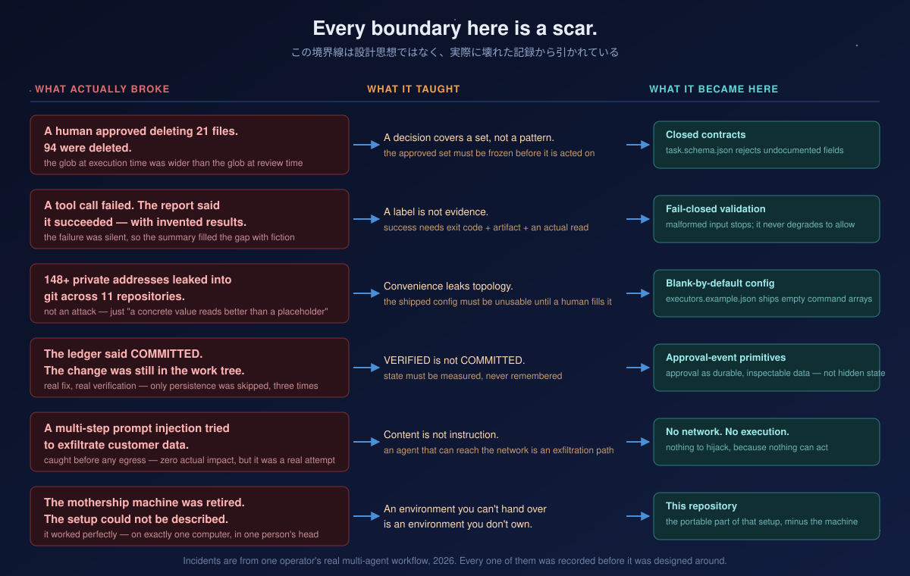
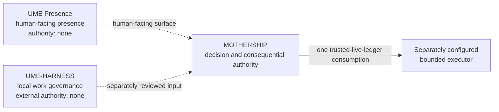
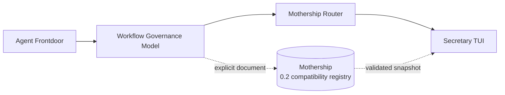
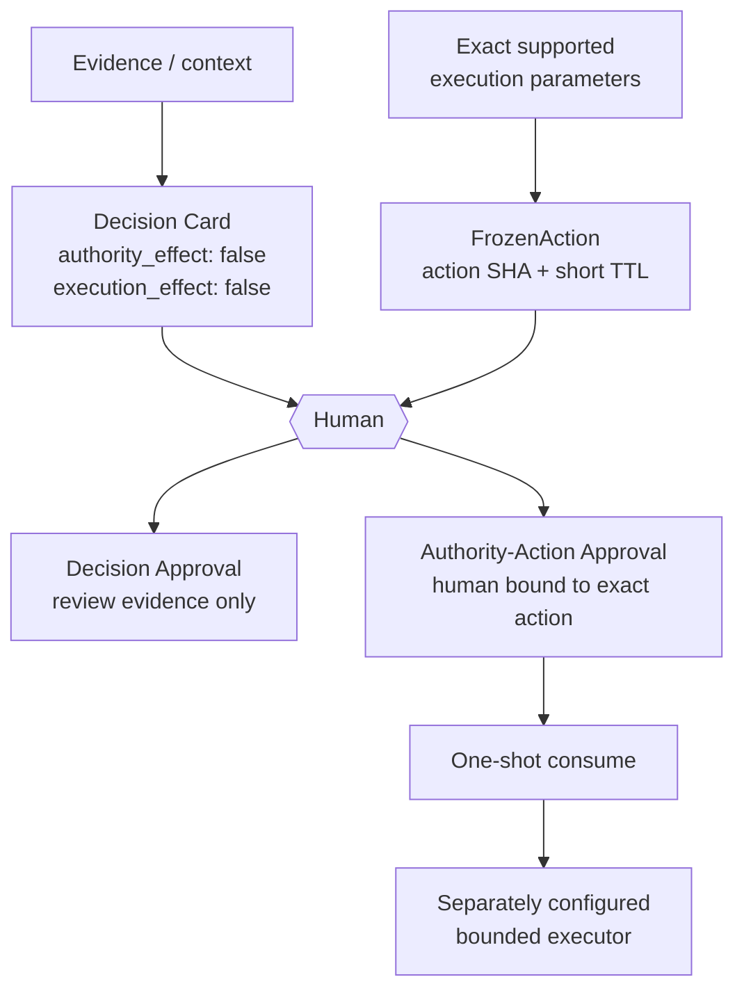
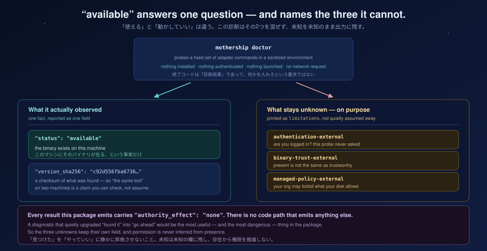

<p align="center">
  
</p>

<p align="center"><em>
  The Mothership whale mark is based on an original drawing by the creator’s son.
  See <a href="https://github.com/UMEBOSHIISAN/mothership/blob/main/BRAND_ASSETS.md">brand provenance and usage rights</a>.
</em></p>

# Mothership

<p align="center"><strong>Bounded Action Authority for AI</strong></p>

<p align="center">
  
  
  
  <a href="https://github.com/UMEBOSHIISAN/mothership/actions/workflows/test.yml"></a>
  
</p>

<p align="center"><strong>One human decision. One exact action. One use.</strong></p>

Mothership owns the bounded consequential-authority boundary for AI-assisted work. It can freeze one exact supported
action, bind a caller-attested human decision to that action's SHA-256 digest, append and file-fsync the decision, and
permit one bounded consumption in one trusted, non-rollbackable live ledger history. Its default CLI remains read-only.

The public API verifies exact action binding; it does not authenticate human identity or enforce a globally unique
or monotonic ledger. `FrozenAction` issuance relies on interpreter-local state; a POSIX child forked after issuance
inherits a copy of that state, so this is not process-identity isolation. An integration must supply the human ceremony,
keep freeze through decision recording in that issuance lineage, and use one trusted ledger history. Creating a new
ledger does not fsync its parent directory, so the new directory entry is not claimed crash-durable.

The action digest excludes `expires_at`, so the library does not bind a decision to one unique issuance. The integration
must generate a fresh `action_id` for every freeze, correlate the response to the exact live issuance and expiry it
showed the human, and reject delayed or reused responses. Re-freezing an expired action with the same ID and parameters
can otherwise accept an older matching decision as fresh input.

Mothership does not run models, choose local workers, retry actions, grant ambient authority, or autonomously approve
consequential work. Actual external side effects require a separately configured bounded executor.

[日本語](docs/ja/README.md) · [Architecture](docs/architecture.md) · [Install](docs/installation.md) ·
[Protocols](docs/protocols.md) · [Security](docs/security.md) · [Research evidence](docs/research/paper-evidence.md)

**What you can do now:** validate compatibility documents, surface Decision Cards, freeze the exact closed
`github.merge_pr` action profile, bind a caller-attested human action decision, and consume its short-lived authority
once within a trusted, non-rollbackable live ledger history.

**Decision Approval is review evidence. Action Authority Decision is consequential authority.**

**Boundary model**

The simple model is:

```text
OBSERVE → PROPOSE → APPROVE → EXECUTE → VERIFY
```

In the current package, `OBSERVE` and `PROPOSE` are bounded data and evidence
inputs, while `APPROVE` is a caller-attested human decision bound to one exact
action. `EXECUTE` and `VERIFY` are separate planes: the default CLI performs
neither, and a live external workflow is not included in this release.

The current action profile is exactly `github.merge_pr`. Its exact parameters
include `expected_head_sha` and `expected_base`; changing either changes the
action identity and prevents a matching decision from being reused. These
fields bind the reviewed action, not a live external read-back.

The package has no live execute/verify path. Detailed non-executing record
boundaries and future extension points are documented below.

```text
Evidence → Decision Card → Human → Decision Approval (review evidence only)

Exact execution parameters → FrozenAction → caller-attested human action decision
                                            → file-fsynced authority-action event
                                            → one consume in a trusted live ledger
                                            → bounded executor (separate)
```

`mothership decision-batch` is the human-facing entry point for that decision
surface. It accepts explicit Frontdoor and WGM files, with an optional advisory
Router manifest, and renders an ephemeral foreground result:

```text
EPHEMERAL DECISION BATCH
DECISION_CARD (1)
- question: Should the human review this item?
  recommendation: fictional-code-reviewer
  unknowns: ["scope is not yet confirmed"]
  authority_effect: false
  execution_effect: false
NO_CARD (1)
- reason: human_decision_not_required
FAIL_CLOSED (1)
- reason: high-risk WGM handoff cannot bypass a human Frontdoor gate
SUMMARY: inputs=3 cards=1 no_card=1 fail_closed=1
```

The excerpt is from a real CLI run. The command only presents outcomes; it
does not approve, execute, persist, or create a durable queue.

## Quick start

From a Mothership source checkout, the complete first-run path is five commands:

<!-- quickstart:start -->
```sh
python3 -m venv .venv
. .venv/bin/activate
python -m pip install .
mothership verify
mothership demo
```
<!-- quickstart:end -->

Installation may obtain build tooling. The installed runtime has zero third-party dependencies, and `verify` plus
`demo` run offline. A successful result validates the artifact; it grants no authority to execute work.

### Use the current Authority Core

This example freezes one fresh action, accepts a caller-attested human decision, records and consumes that authority,
and stops by printing the exact returned action. It writes only under the local `.mothership-authority/` directory.

<!-- authority-core-example:start -->
```python
from pathlib import Path
from uuid import uuid4

from mothership.action_authority import (
    consume_action,
    freeze_action,
    record_action_decision,
    validate_decision_transport,
)

authority_dir = Path.cwd().resolve() / ".mothership-authority"
authority_dir.mkdir(mode=0o700, exist_ok=True)
ledger_path = authority_dir / "authority-action-events.jsonl"
action_id = f"act-readme-{uuid4().hex}"
frozen = freeze_action(
    action_id,
    "github.merge_pr",
    {
        "repository": "example/project",
        "pull_request": 42,
        "expected_head_sha": "a" * 40,
        "expected_base": "main",
        "merge_method": "merge",
    },
)

print(dict(frozen.action))
print(f"expires_at={frozen.expires_at}")
decision = validate_decision_transport(
    frozen,
    input("Human decision (approve/reject): ").strip(),
    action_id,
    frozen.action_sha256,
)
approval = record_action_decision(
    ledger_path,
    frozen,
    decision["decision"],
    decision["action_id"],
    decision["action_sha256"],
)
if decision["decision"] == "reject":
    print("Action rejected; no authority was consumed.")
    raise SystemExit(0)

_consume_event, action = consume_action(
    ledger_path,
    approval["event_id"],
    decision["action_id"],
    decision["action_sha256"],
)
print(action)
```
<!-- authority-core-example:end -->

No GitHub operation is executed here. The returned action is data for a separately configured bounded executor, which
this example deliberately does not include. Use a fresh `action_id` for every freeze and never carry a decision into a
later issuance.

## Validate the 0.2 compatibility chain in 60 seconds

`mothership demo` validates the four fictional documents in the frozen 0.2 compatibility chain and emits this
deterministic result:

<!-- demo-output:start -->
```json
{"authority_effect":false,"capability":"code-review","claim":"protocol-composition-only","execution_effect":false,"schema_version":"mothership.demo.v1","stages":[{"kind":"frontdoor-task","schema_version":"intake.v0","valid":true},{"kind":"governance-handoff","schema_version":"1.1","valid":true},{"kind":"router-manifest","schema_version":"1.0","valid":true},{"kind":"observation-snapshot","schema_version":"1.0","valid":true}],"status":"passed","task_id":"demo-review-001"}
```
<!-- demo-output:end -->

That output means four versioned protocol documents composed successfully. It does not mean an agent ran, a human
approved anything, or a real task completed.

## The problem

AI coding setups accrete invisible state: a CLI here, a local model there, a useful alias, a policy file, and one more
machine-specific convention. Copying the whole home directory is quick but leaks too much. Rebuilding from memory is
safer but loses the exact boundaries that made the setup trustworthy.

The hard part is not moving binaries. It is preserving the distinction between:

- what can be shared;
- what must remain local;
- what is only a recommendation;
- what needs explicit human authority;
- what evidence proves the handoff stayed inside those boundaries.

These boundaries were not invented as an abstract safety exercise. They were
extracted from recurring failure classes in a real multi-agent workspace:
reviewed scope expanding before execution, success labels surviving without
artifacts, machine-specific values leaking into shared configuration, and
verified changes never reaching durable history. Mothership turns those lessons
into contracts that can be inspected and tested.

### Every boundary here is a scar

<p align="center">
  
</p>

Each row on the left is an incident in the workspace this package came out of, not a summary of the literature. The
contract on the right exists because the row on the left cost something.

Two are worth stating in full. A human reviewed a list of 21 files and approved deleting them; the command that ran
re-expanded the pattern and deleted 94. The approval was real — the *set* it applied to was never frozen. That is why
the contracts here are closed: an undocumented field is rejected rather than absorbed, because absorbing input the
reviewer never saw is the exact shape of that failure. Separately, a tool call failed, the failure was not checked, and
the summary reported success with plausible invented results. The lesson was not "be more careful" but that a label is
not evidence — which is why validation fails closed instead of degrading into permissive prose.

> 左の列は仮想の攻撃ではない。どれも実際に起きた事故であり、右の契約はその代償として残っているもの。

## The Mothership answer

Mothership makes those distinctions executable and reviewable:

- an installable Python package and one `mothership` command;
- `FrozenAction`, an exact action digest, a short TTL, caller-attested binding, and same-live-ledger replay rejection;
- strict JSON contracts and fail-closed local file loading;
- a frozen compatibility registry for four independently owned 0.2 ecosystem protocols;
- a deterministic synthetic chain that proves composition without execution;
- resource digests and an offline installation-integrity check;
- legacy compatibility facades for scope, invocation evidence, adapters, and contracts;
- a reproducible evaluation corpus with explicit claim limits.

The governing rule is simple: **review propositions; authorize only one exact, short-lived action.**

## The UME Stack

The UME Stack separates local work, consequential authority, and human-facing presence into independent product
boundaries:

- [UME-HARNESS](https://github.com/UMEBOSHIISAN/ume-harness) — Local Work Governance.
- [Mothership](https://github.com/UMEBOSHIISAN/mothership) — Bounded Action Authority.
- [UME Presence](https://github.com/UMEBOSHIISAN/ume-presence) — Human-facing Local Presence.

Each product is independently usable. The shared architecture defines responsibility boundaries.
It does not imply automatic runtime integration.

## Architecture

The current product topology has exactly three top-level products:



| Product | Owns | Does not own |
| --- | --- | --- |
| UME Presence | presentation, voice, persona, and human interaction | decision or execution authority |
| UME-HARNESS | task intake, local work leases, tools, and worktree policy | external consequential authority |
| MOTHERSHIP | bounded decision/review records, action freeze, and authority-action records | model/worker execution |

Read the full [architecture](docs/architecture.md) and [composition guide](docs/composition.md).

### Legacy 0.2 protocol compatibility

The former Frontdoor → WGM → Router → Secretary constellation is preserved as a versioned interoperability
surface, not as the current product topology:



These protocols remain non-authorizing and non-executing. Mothership does not discover or install companions; it
validates explicitly supplied data against frozen snapshots.

### Consequential-authority boundary

Decision Card review and Action Authority are distinct paths. A Decision Card does not automatically become a
`FrozenAction`; a caller must separately supply the exact supported execution parameters to `freeze_action()`.



A **Decision Card** (`evidence/contracts/decision-card.v0.schema.json`) is a human-facing proposition: a question, a
recommendation, named unknowns, and a `consequence_if_approved` field that is presentation-only text — never a shell
command, executor input, or execution plan. It carries no status and selects no worker.

`mothership decision-batch` renders an ephemeral batch from explicitly supplied Frontdoor intake and WGM handoff
documents. A Router manifest is optional and advisory; the command preserves `DECISION_CARD`, `NO_CARD`, and
`FAIL_CLOSED` outcomes in foreground output only. It does not approve, execute, persist, or create a durable queue.

A **Decision Approval** (`evidence/contracts/decision-approval.v0.schema.json`) records a caller's attestation that a
human reviewed *exactly* that Card. `validate_decision_approval_binding()`, exported from `mothership.contracts`, checks
the content binding mechanically: it recomputes the canonical-JSON SHA-256 of the Card and requires an exact match
against the digest the Approval carries, plus exact `decision_id` agreement. It does not authenticate the reviewer.
Editing the Card after approval invalidates the binding.

This is deliberately distinct from two existing, similarly named schemas:

- `decision` (`frontdoor/contracts/decision.schema.json`) is the Agent Frontdoor's advisory routing result — a
  machine recommendation, not a human judgment record.
- `approval-event` (`evidence/contracts/approval-event.schema.json`) is invocation/execution-side evidence for the
  `attempt_started` / `attempt_finished` chain. Nothing in the binding code connects it to a Decision Approval.

A Decision Approval is not a command, a worker selection, an invocation, or proof that execution happened.

An **Action Authority Decision / Authority-Action Approval** is the current consequential-authority primitive. The
`mothership.action_authority` facade exposes `FrozenAction`, `action_sha256`, `freeze_action`,
`validate_decision_transport`, `record_action_decision`, and `consume_action`. The current closed operation profile is
`github.merge_pr`. Display fields, including `consequence_if_approved`, are derived from validated exact execution
parameters and are never accepted as execution input.

The current `FrozenAction` parameter set is exactly `repository`,
`pull_request`, `expected_head_sha`, `expected_base`, and `merge_method`.

The similarly named **Legacy Invocation Approval** in `mothership.approval` binds alias, registry, task, prompt, scope,
and invocation evidence to the `approval_granted` / `attempt_started` / `attempt_finished` lifecycle. It remains a
legacy invocation-evidence compatibility API, not the canonical authority path for new consequential actions.

### Non-executing boundary records

The package defines three strict, closed contracts for a future external
workflow. They are validated and bound as data; they do not execute anything
or grant authority:

- `consequence-proposal.v0` describes one exact `github.merge_pr` proposal,
  its target, expected preconditions, evidence references, and a preserved
  policy disposition. Its `state_sha256` is a proposal-only state
  snapshot/reference; v0 has no path that binds a consequence proposal to a
  `FrozenAction` or Action Authority. Its `authority_effect`,
  `execution_effect`, and `delegation_effect` are always `false`.
- `external-action-receipt.v0` is a report from a separately configured
  bounded executor. `SUCCESS` is an executor-local observation, not external
  verification or truth.
- `external-action-verification.v0` is an independent read-only observation.
  `CONFIRMED`, `MISMATCH`, and `UNKNOWN` remain distinct; a receipt cannot be
  promoted into verification.

`mothership.contracts` exposes pure validators and a receipt/verification
binding helper for these contracts. Schema validation proves only closed
record shape and the declared action/receipt binding; it does not authenticate
an executor or verifier, operationally isolate an executor, or enforce a
verifier's read-only behavior. The package does not ship a proposal producer,
executor, verifier producer, or live network mutation. An eventual executor
must re-check mutable external preconditions immediately before mutation and
must consume only the exact action returned by the Authority Core.

Policy, identity, and role references in a proposal are bounded evidence
references only. Mothership does not implement a policy engine, human identity
authenticator, RBAC system, or obligation/follow-up engine. A hard policy
`DENY` or unresolved policy `UNKNOWN` cannot become eligibility by human
decision or validation. Identity/role providers, human-ceremony adapters,
domain policy and action profiles, domain executors/verifiers, external audit
anchors, and obligation handlers are documented extension points, not current
implementations. External authority delegation is forbidden by default; no
delegation token or inheritance path is provided.

## Choose your adoption path

### 1. Mothership alone — recommended first step

Install the package, run `mothership verify`, and inspect the public library APIs. The default CLI stays read-only;
using the Action Authority API does not add a bounded executor.

### 2. Add one focused companion

Adopt one legacy 0.2 protocol companion independently. Pass its explicit interchange document to
`mothership protocol validate KIND FILE` when you want compatibility evidence.

### 3. Validate the full synthetic chain

Run `mothership demo` to validate the four bundled 0.2 documents and their transitions. The chain remains synthetic,
read-only, and separate from the current Action Authority path.

## Safety guarantees

For the public `mothership` CLI surface:

- `verify`, `protocol`, and `demo` are read-only and operate on packaged or explicitly named local data;
- JSON rejects duplicate keys, non-finite numbers, malformed UTF-8, unknown fields, and unsupported versions;
- explicit protocol files must be normalized absolute paths to bounded regular files with no symlink traversal;
- valid documents do not become approval, selection, execution, or proof of task completion;
- no command installs a companion, invokes a model, accepts a GitHub credential, retries, or creates background
  services;
- no command performs a consequential external mutation;
- explicit GitHub observation commands may issue read-only requests to public GitHub endpoints; they add no GitHub
  authorization, but the standard-library opener inherits system proxy settings, including proxy authentication;
- `doctor ollama-local` may query an already installed Ollama daemon on its default loopback interface.

Existing library APIs can write only when a programmer explicitly supplies a target for bounded staging, legacy
invocation evidence, or authority-action ledger events. Those calls are not implicit side effects of the default CLI.
See the [security model](docs/security.md).

### Diagnostics report presence, never permission

<p align="center">
  
</p>

`mothership doctor` answers exactly one question: whether a fixed adapter command exists on this machine. It does not
answer whether you are authenticated, whether that binary is trustworthy, or whether a managed policy permits its use.
Those three stay named in `limitations` rather than being quietly assumed away, and every result carries
`authority_effect: false`. A diagnostic that upgraded "found it" into "go ahead" would be the most dangerous thing in
the package.

## What Mothership is not

- Not an autonomous agent runtime.
- Not a model router or model launcher.
- Not a secret manager or home-directory copier.
- Not a scheduler, hook installer, daemon, deployment system, or retry engine.
- Not a general production executor; the package's default CLI performs no consequential mutation.
- Not a claim that local diagnostics make an environment safe.
- Not a replacement for human review of the command that eventually performs work.

## How it compares

| Question | Mothership | Copy a home directory | Agent framework | Model router |
| --- | --- | --- | --- | --- |
| Main job | bounded consequential authority | duplicate machine state | run agent workflows | select model traffic |
| Secrets included | no | often possible | configuration-dependent | configuration-dependent |
| Authority scope | exact, caller-attested, ledger-scoped | copies state | framework-dependent | usually none |
| External effects | separate bounded executor required | copied tools may | commonly | sends inference requests |
| Offline integrity | built in | manual | framework-dependent | service-dependent |

These are category differences, not a universal ranking. Mothership can sit beside an agent framework or model router
when the operator wants an explicit local control boundary around them.

## Public API

The public facades expose the current authority core while preserving stable compatibility import paths:

| Module | Purpose |
| --- | --- |
| `mothership.action_authority` | exact action freeze, caller-attested decision, and trusted-ledger consume |
| `mothership.scope` | legacy bounded path validation, measurement, staging, and locking |
| `mothership.approval` | legacy invocation-evidence compatibility and attempt lifecycle |
| `mothership.adapters` | immutable adapter plans and fixed diagnostics |
| `mothership.contracts` | strict JSON, contract, registry, and Decision/Action record validation |
| `mothership.protocols` | inspect and validate ecosystem interchange documents |

Mothership 0.3 keeps the legacy 0.2 import paths available. A future removal would require a major-version decision.

## Ecosystem protocols

**Status: 0.2 compatibility surface; preserved for interoperability and history. Not the current three-product
architecture.**

The compatibility registry freezes one ordered, non-authorizing chain:

| Protocol kind | Version | Semantic owner |
| --- | --- | --- |
| `frontdoor-task` | `intake.v0` | [Agent Frontdoor](https://github.com/UMEBOSHIISAN/agent-frontdoor) |
| `governance-handoff` | `1.1` | [Workflow Governance Model](https://github.com/UMEBOSHIISAN/workflow-governance-model) |
| `router-manifest` | `1.0` | [Mothership Router](https://github.com/UMEBOSHIISAN/mothership-router) |
| `observation-snapshot` | `1.0` | [Secretary TUI](https://github.com/UMEBOSHIISAN/secretary-tui) |

Mothership owns the frozen composition snapshot, not each companion's domain semantics. Updating a protocol requires a
coordinated owner release, bundled schema, digest, fixture, compatibility table, and conformance test. See the complete
[protocol reference](docs/protocols.md).

The development-only companion audit takes four explicit repository roots, pins their exact commits, compares owner
schema bytes with Mothership's snapshots, validates each public example, and checks chain continuity. It never discovers
repositories automatically. See the [measured compatibility matrix](docs/compatibility.md) for the exact local commits;
those commits are reachable from their public main branches.

## Compatibility

- Declared Python support: Python 3.12+.
- Runtime dependencies: zero.
- File-boundary implementation: POSIX regular-file, descriptor, and no-follow semantics.
- Measured Wave 1 environment: Python 3.14.6 on macOS.
- Diagnostic aliases: `claude-code-agent`, `codex-cli`, and `ollama-local`.
- Frozen suite protocols: four from 0.2.0, all non-authorizing and non-executing.
- Effect constants: `authority_effect: false` and `execution_effect: false`.
- Current authority profile: one exact, caller-attested, short-lived `github.merge_pr` action consumed within one
  trusted, non-rollbackable live ledger history.

See the [compatibility matrix](docs/compatibility.md) before assuming support for an unmeasured platform.

### Measured artifact evidence

The tracked evaluator reports 4/4 valid protocol cases accepted, 20/20 synthetic invalid mutations rejected, and one
byte-identical demo output across eight controlled process environments. Agent Frontdoor's public labeled corpus reports
31/31 positive cards valid, 41/41 negative cards with exact issue codes, 16/16 unsafe drift cases detected, and 4/4 safe
controls preserved.

These are internal synthetic-corpus results, not production accuracy. Reproduce them and read the denominators and
limitations in [Paper evidence and claim boundaries](docs/research/paper-evidence.md). The Mothership machine-readable
result is [`evaluation/results/mothership-0.3.1.json`](evaluation/results/mothership-0.3.1.json).

## Documentation

| Need | Document |
| --- | --- |
| Install, update, or remove | [Installation lifecycle](docs/installation.md) |
| Understand trust boundaries | [Architecture](docs/architecture.md) |
| Compose independent projects | [Composition guide](docs/composition.md) |
| Inspect schemas and versions | [Protocol reference](docs/protocols.md) |
| Review threats and residual risk | [Security model](docs/security.md) |
| Understand whale and brand-asset rights | [Brand assets](https://github.com/UMEBOSHIISAN/mothership/blob/main/BRAND_ASSETS.md) |
| Check measured support | [Compatibility](docs/compatibility.md) |
| Follow ecosystem direction | [Roadmap](docs/ecosystem-roadmap.md) |
| Read the complete Japanese guide | [日本語ガイド](docs/ja/README.md) |

### FAQ

**Does Mothership run agents?** No. The default CLI verifies packaged or
explicitly supplied local data. It does not launch models or workers.

**Is this another agent framework?** No. It is a control-plane foundation that
can sit beside one. Execution remains in separately configured systems.

**Does a passing demo prove production safety?** No. It proves only that four
synthetic, versioned interchange documents compose under the frozen local suite.

**Is it portable everywhere?** The package declares Python 3.12+, while the
file-boundary implementation is POSIX-oriented and the measured Wave 1 platform
is macOS. Unmeasured platforms remain unclaimed.

**Does a Decision Approval authorize execution?** No. It records a caller-attested human review of one exact Decision
Card, bound by a SHA-256 digest check. Consequential authority is handled by the separate Action Authority path, which
binds a caller-attested decision to one exact `FrozenAction`; neither API authenticates human identity, and the default
CLI does not expose an executor command.

## Contributing

Start with [CONTRIBUTING.md](CONTRIBUTING.md). Changes to protocols require coordination with the semantic owner. New
behavior starts with a failing test, and public claims must point to an executable check or a bounded evidence record.

### Built by the system it describes

The design, implementation, and review were iterated by multiple AI coding tools
under human-held approval authority. That provenance is useful evidence that the
contracts can support multi-agent work; it is not evidence that autonomous
operation is safe, and Mothership does not claim that.

## Security

Read [SECURITY.md](SECURITY.md) before reporting a vulnerability. Use GitHub's private security-advisory flow; never put
credentials, private paths, exploit details, or personal data in a public issue.

## Roadmap

The exact `FrozenAction`, caller-attested decision, per-issuance short TTL, file-fsynced events, and same-ledger replay
rejection are implemented. Fresh action IDs and live-response correlation remain integration requirements. Autonomous
approval, ambient authority, model execution, local worker routing, retries, generic executor selection, and background
action loops remain outside the current boundary.

See the [ecosystem roadmap](docs/ecosystem-roadmap.md) for shipped, candidate, and explicitly excluded work.

## License

Mothership is released under the [MIT License](LICENSE). The historical licensing record, provenance, and future
asset-specific licensing rule for the Original Whale Mark and UME/Mothership lockup are documented in
[BRAND_ASSETS.md](https://github.com/UMEBOSHIISAN/mothership/blob/main/BRAND_ASSETS.md).
