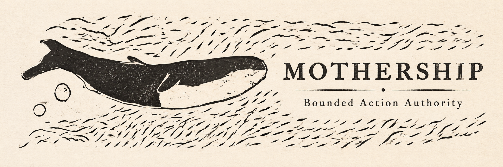
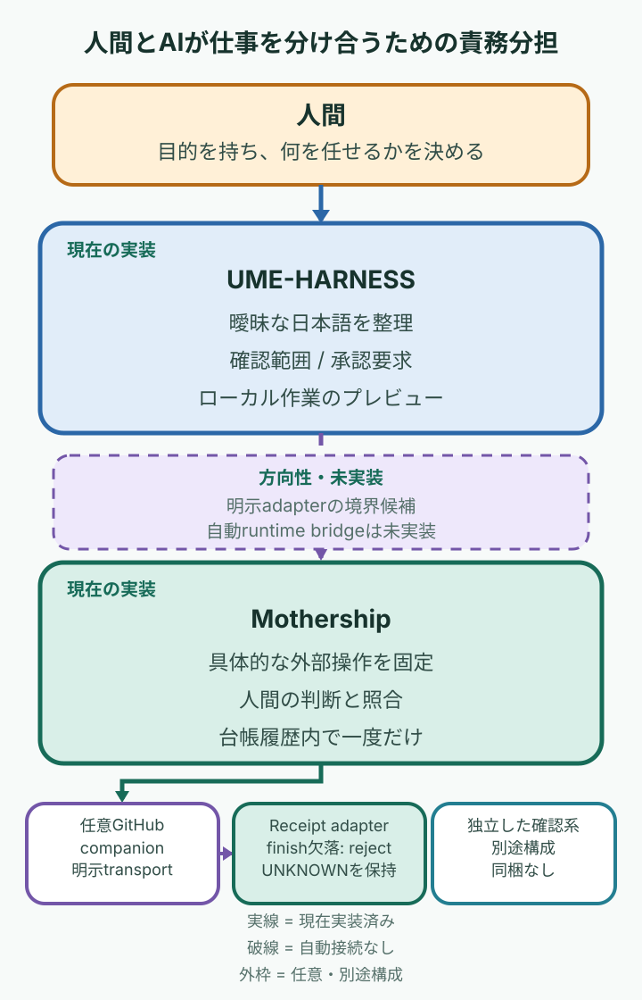
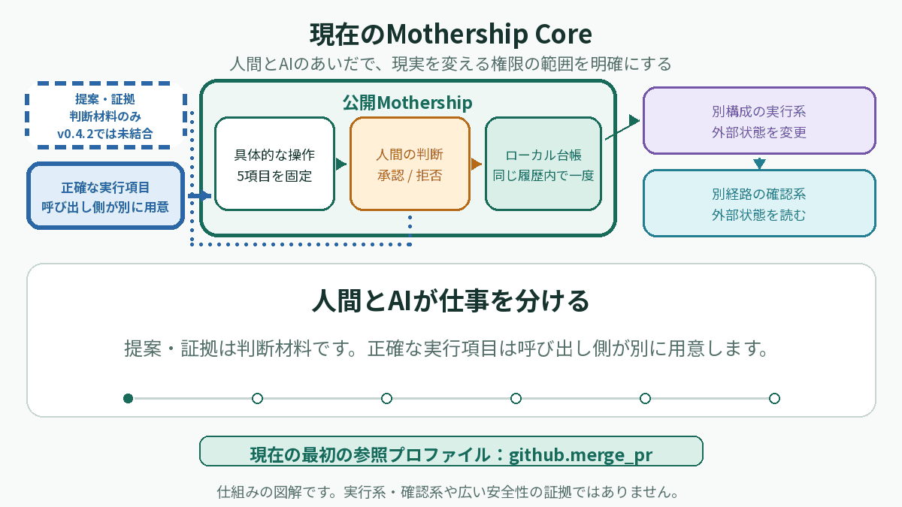
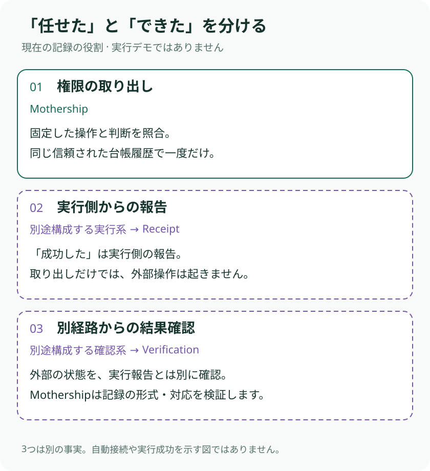
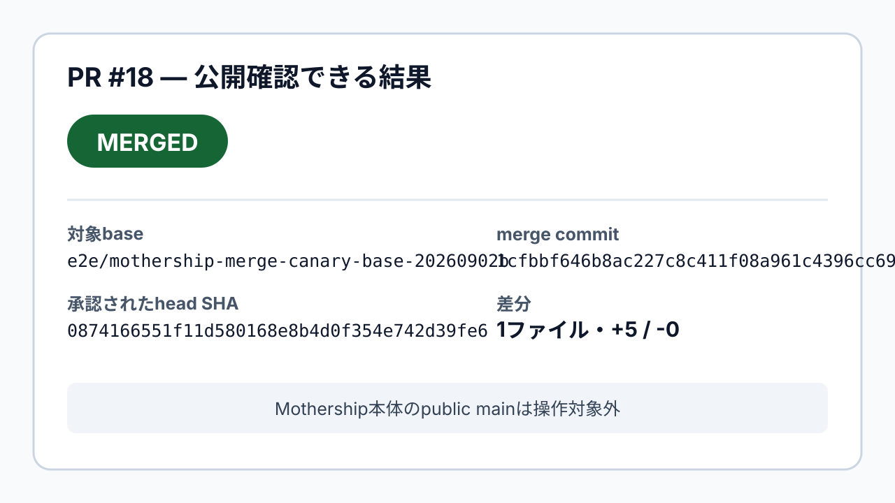

# Mothership

> 公開source main上の未リリース候補（Core 0.4.3.dev0、optional companion 0.2.0.dev0）。
> 公開リリースや実運用の証拠ではありません。[候補の変更と制約](docs/option-a-candidate.md)。

[English](README.en.md) · [v0.4.2](https://github.com/UMEBOSHIISAN/mothership/releases/tag/v0.4.2) ·
[CI](https://github.com/UMEBOSHIISAN/mothership/actions)

<p align="center">
  
</p>

公開済みv0.4.2はdocs-onlyのリリースでした。公開source mainはAuthority Coreのruntime契約を保持し、文書・画像を更新して、未リリースの案A変更を追加しています。

> 使うAIが変わっても、仕事の主導権は手元に。
>
> 人間が全部を抱えず、AIにも全部を明け渡さない。

Mothershipは、人間とAIが仕事を分け合うために、任せる操作を事前に固定し、
人間の判断と結び付ける、オープンソースの中核実装です。
判断・権限の使用・実行報告・独立した結果確認を、それぞれ別の記録として扱います。

現在は、GitHub PRのマージを最初の参照例として、操作の固定、判断との照合、
同じ信頼されたローカル台帳履歴内での一回限りの取り出しを提供しています。

AIチャットアプリや完成済みの業務システムではありません。
モデル実行、本人認証、業務システムへの接続、実行・結果確認の処理は別途構成します。
明示的に呼び出す読み取り専用のGitHub観測CLIは提供します。

## PURPOSE

人間とAIが仕事を分け合うには、「できる」と「やってよい」を分ける必要があります。
Mothershipは、AIを止めることではなく、人間が具体的な仕事を安心して任せられるように、
その受け渡しを曖昧にしないことを目指します。

| 区別 | 意味 |
| --- | --- |
| Capability | AIやツールに何ができるか |
| Authority | そのうち何をしてよいか |
| Decision | 人間が今回どこまで任せると決めたか |
| Execution | 現実にどの操作が行われたか |

安全性は製品カテゴリーではなく、これらを混ぜずに扱うための成立条件です。

## 責務分担

UME-HARNESSは、人間の意図を範囲の見えるローカル作業案へ整理します。
Mothershipは、人間の判断をひとつの外部操作に対する限定Authorityへ結び付けます。

<p align="center">
  
</p>

これは責務分担の方向を示す図です。現在の公開版同士に自動接続はありません。破線部分は未実装です。
source mainの任意GitHub companionは実行とreceipt変換を担い、transportと独立確認系は別途構成します。

## CURRENT: v0.4.2

公開済みv0.4.2（歴史的な公開ベースライン）が提供したのは、ひとつの対応済み外部操作を固定し、
caller-attestedな人間の判断と照合し、ローカル台帳へ記録して一度だけ取り出す境界です。

実装済み:

- 対応済み操作パラメータの検証と `FrozenAction` への固定
- approve / rejectとaction ID・digestの照合
- decision eventのローカル台帳への記録
- 同じ信頼されたローカル台帳履歴での一回限りのconsume
- executorのReceiptと別経路Verificationを分けるclosed contract

現在含まないもの:

- UME-HARNESSとのruntime bridge
- 汎用executor、verifier producer、credential manager、retry、daemon
- human identity authentication
- 任意operationや自動実行

proposalとevidenceは判断材料ですが、FrozenActionへ機械的に結び付けられません。
Mothershipは、対応済みの実行パラメータを別に受け取り、それを先にfreezeします。

### current main: Core 0.4.3.dev0 + companion 0.2.0.dev0

公開source mainには、v0.4.2の境界を保持した未リリースのCore `0.4.3.dev0`と、
それに厳密に依存する任意導入のGitHub companion `0.2.0.dev0`が含まれます。

Coreは `github.merge_pr` のexact parameterを検証して `FrozenAction`へ固定し、
caller-attestedな判断を照合して、信頼されたlive ledgerで一度だけconsumeします。
Coreは外部操作を実行せず、executorや独立したGitHub verifier producerも含みません。

GitHub companion（opt-in）は、Core発行の `FrozenAction`、厳密な台帳path、approval event ID、
明示transportだけを受け付けます。read-only preflight後にCoreのconsume結果を使ってattemptを記録し、
最大1回のPUTを試みます。認識済みのclient failureは `failure`、その他のfailure・timeout・矛盾した応答は
`reconciliation_required` として保持されます。finish欠落など不完全なpairはadapterがrejectし、retryや
reconsumeは行いません。companionの `github-execution-attempt.v1` はCoreのReceipt/Verificationとは別です。

opt-inの[receipt adapter](examples/github_receipt_adapter.md)は、検証済みterminal attempt pairを
Coreの `external-action-receipt.v0` へ投影します。callerが渡す `action_id`、`action_sha256`、
`consume_event_id` を正確に照合し、`github-attempt:<start event ID>` と
`canonical_json_sha256({"started": started, "finished": finished})` を証拠参照に使います。
validなterminal pairでは、強いsuccessは `SUCCESS`、認識済みclient failureは `FAILED`、その他のfailureと
`reconciliation_required`は `UNKNOWN` へ投影されます。欠落・曖昧・未観測の値を `SUCCESS` に補完せず、finish欠落や
不整合pairはrejectされます。adapterはauthorityを付与せず、記録を認証・保存せず、独立したverifier recordも生成しません。

Coreとcompanionは別packageで、adapterの利用はopt-inです。自動runtime bridgeや別repo間の自動接続はありません。
責務と接続条件は [composition guide](docs/composition.md) に整理しています。
オフラインの合成例は、source checkoutのルートで
`PYTHONPATH=.:packages/mothership-github python examples/github_receipt_adapter.py` を実行してください。
出力は合成recordのbinding確認であり、GitHub操作、credential、ledger consume、独立した外部確認を示しません。

companionのopt-in `verify_merge_pr()` は、Coreが発行した正確な `FrozenAction` と検証済みReceiptへ結び付いた
GitHub read-back Verificationを生成できます。既定経路は公開tokenless GETを最大2回（PRとGit Databaseのmerge commit）だけ行い、
PRとcommitのサニタイズ済みprojection、UTCの取得境界、固定reason code、canonical hashだけを保持します。
不正・矛盾・時刻不整合は `UNKNOWN`、対象head・baseまたはmerge topologyの有効な不一致は `MISMATCH` として残り、
ReceiptのstatusはVerificationを選びません。authority/ledgerのconsumeや書込み、executor呼出し、retry、pollingは行いません。
注入openerの結果はsynthetic/host-attestedなオフライン証拠であり、GitHub・executor・人間・merge方法の認証ではありません。
詳しくは [offline read-back example](examples/github_readback_verification.md) と
[composition guide](docs/composition.md) を参照してください。

## 現在のMothership Core

<p align="center">
  <picture>
    <source media="(prefers-reduced-motion: reduce)" srcset="assets/readme/ja/mothership-flow-poster.png">
    <source media="(max-width: 600px)" srcset="assets/readme/ja/mothership-flow-poster.png">
    
  </picture>
</p>

これは未リリースsource mainの仕組みの図解です。Core、任意companion、receipt adapter、別経路の独立確認を区別しています。GIFそのものは実行証拠ではありません。
動きを抑える設定または600px以下の画面では、同じ意味の縦型静止ポスターを表示します。

対応済みの実行パラメータを固定してから、人間の判断として渡された応答を
action IDとdigestへ照合し、判断eventを記録します。同じaction IDのconsumeは、
ひとつの信頼されたローカル台帳履歴内で一度だけです。

### 権限の取り出しと、仕事の完了は別

<p align="center">
  
</p>

Mothershipは実行報告と独立確認の記録を分けて検証します。
任意adapterはterminal attempt pairをReceiptへ変換し、UNKNOWNを保持します。
finish欠落は拒否します。ReceiptのSUCCESSだけでは独立確認になりません。

## 現在の参照profile

最初のcurrent reference profileは `github.merge_pr` です。
これはMothershipの用途全体ではなく、5つの実行パラメータの固定、判断との照合、
台帳記録、一回限りのconsume境界を具体化した最初の実装例です。

現在固定する値:

- repository
- pull request number
- expected head SHA
- expected base branch name
- merge method

base commit SHAは結び付けられません。`expires_at`はaction digestに含まれません。
統合側は毎回新しい `action_id` を発行し、表示した発行情報と期限へ応答を対応付け、
遅延または再利用された応答を拒否してください。

## 公開結果の一例

[PR #18の公開結果](docs/evidence/github-merge-pr-e2e-20260903/README.md)は、
隔離されたcanary baseに対するひとつの `github.merge_pr` を記録した一例です。
公開GitHubのread-backから、対象head SHA、merge commit、親、対象差分量を確認できます。

<p align="center">
  
</p>

これはPR #18に限った公開結果です。非公開の全履歴を公開物だけで再現できること、
汎用的な安全性、本番運用への適合は主張しません。

**v0.4.2での変更点**

README画像の生成用依存関係をPillow 11.3.0から12.3.0へ更新しました。
日英のGIFと静止ポスターを再生成し、`SHA256SUMS`を更新しています。
図の意味、Authority Coreの機能、実行権限の扱いは変わりません。
Pillowは画像生成時だけ必要で、Mothershipの実行時依存関係には追加されません。
オフラインのAuthority Core walkthrough（下記）を追加しました。
runtimeのAuthority Core挙動、承認受理条件、対応操作profileはv0.4.1から変更していません。

## クイックスタート

Python 3.12以上と、このリポジトリのソースcheckoutが必要です。
まず[clone手順](docs/installation.md#clone-first-install)で取得し、リポジトリのルートで実行してください。
下記のwalkthroughはv0.4.1公開後に追加された例で、v0.4.1タグやwheelには含まれません。
v0.4.2のwheelにも含まれません（source checkout専用の実行例です）。

<!-- quickstart:start -->
```sh
python3 -m venv .venv
. .venv/bin/activate
python -m pip install .
python examples/authority_core_walkthrough.py
mothership verify
```
<!-- quickstart:end -->

`python examples/authority_core_walkthrough.py`は、外部通信や認証情報を使わず、
操作の固定、表示の導出、合成した承認記録、一度だけのconsume、二度目の取り出し拒否を確認します。
これは人間の承認ceremonyや本人認証ではありません。GitHubを変更せず、executorや確認系も起動しません。

`mothership verify`は、同梱resource inventory、schema、registry、fixture、digestを
オフラインで検査します。host、外部環境、インストール済みの全コードの安全性を検査するものではありません。

`mothership demo`はlegacy 0.2のsyntheticなprotocol-composition demoです。
Authority Coreの証明でも、agent実行、人間の承認、実タスク完了の証拠でもありません。
現在のAuthority Coreを体験する入口ではありません。

## 現在の制約

| 項目 | v0.4.2で実装していること | 実装・認証していないこと |
| --- | --- | --- |
| identity | caller-attested decisionを保持 | 人間の本人確認は行いません |
| decision event | 同じactionへ複数のdecision eventを記録できる | 一つのterminal decision、supersede、revoke |
| consume | 同じaction IDは同じ台帳履歴内で一度だけconsumeできる | コピー・復元した台帳をまたぐglobal replay防止 |
| action scope | `github.merge_pr`の5つのexact parameterを固定 | base commit SHAのbind、任意operation |
| expiry | 短いTTLを表示・検査 | `expires_at`をaction digestへbind |
| execution | 別executorへ渡すdataを返す | live executor、credential、retry、daemon |
| verification | ReceiptとVerificationのshape・bindingを検査 | verifier producerのidentityやread-only動作 |
| package check | 同梱inventoryとdigestを検査 | host、全インストールコード、外部安全性 |
| public result | PR #18のbounded result | generic safety、production readiness、private trace再現性 |

本実装は、本番運用または規制対象の高リスク用途への適合を認証するものではありません。
一回限りの再利用拒否は、ひとつの信頼されたローカル台帳履歴に限られます。

## 詳細ドキュメント

### コードツアー

- [`orchestration/lib/action_authority.py`](orchestration/lib/action_authority.py) — 操作の固定と判断の照合
- [ledger implementation](orchestration/lib/action_authority_ledger.py) — 台帳への追記と一回限りの使用
- [external-action contracts](orchestration/lib/external_action.py) — 結果報告と独立確認の記録形式
- [`tests/test_action_authority.py`](tests/test_action_authority.py) — Authority Coreの境界テスト
- [ledger tests](tests/test_action_authority_ledger.py) — 再利用と台帳履歴のテスト
- [external-action tests](tests/test_external_action_contracts.py) — 外部操作の記録形式のテスト

### 背景と互換性

この境界は、承認時に見た対象と実行時の対象がずれた運用事故、および未確認のtool failureを
success summaryとして扱った事故から学んでいます。labelをevidenceとして扱わず、不明なら停止します。

Frontdoor、WGM、Router、Secretaryのprotocolはlegacy 0.2互換と履歴のために残しています。
現在のAuthority Core実行経路ではありません。

### リファレンス

- [Architecture](docs/architecture.md)
- [Installation](docs/installation.md)
- [Protocols](docs/protocols.md)
- [Security model](docs/security.md)
- [Composition guide](docs/composition.md)
- [0.2互換protocolの履歴](docs/legacy/compatibility-0.2.md)
- [English README](README.en.md)

## License

プロジェクトのコードはMITです。詳細は [LICENSE](LICENSE) を参照してください。
README asset生成用に同梱するNoto Sans JPは
[SIL Open Font License 1.1](assets/readme/source/fonts/OFL-1.1.txt)です。
