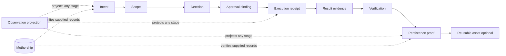

# Architecture

Mothership is an installable hub for an explicitly supplied Flight Bundle. It verifies linked evidence without launching
an agent or granting authority. Companion protocols remain independently adoptable and retain their semantic ownership.

## v0.3 Flight graph



The portable directory has `flight.json`, `events.jsonl`, and optional `artifacts/`. A derived `report.md` is excluded
from integrity calculations. The index and transport log are inputs, not proof of an unobserved action.

## Ownership boundary

| Responsibility | Owner | Mothership role |
| --- | --- | --- |
| Intent and bounded scope | Agent Frontdoor | Reference and validate artifacts |
| Evidence, claims, approval, receipts, verification | Workflow Governance Model | Reuse frozen semantics |
| Approval-bound selection | Mothership Router | Verify and link bindings |
| Worker and team events | Agent Team Runtime | Import explicit compatible events only |
| Append-only evidence | Evidence Spine Core | Reference and verify records |
| Cross-run relationships | Run Lineage Core | Project lineage into replay and reports |
| Composition, verdict, replay, presentation | Mothership | Evaluate the supplied run |

No arrow is an implicit process launch. Mothership does not discover companions, invoke models, or promote records into
authority.

## v0.2 compatibility projection

The retained v0.2 chain is a supported projection, not a complete flight:

```text
frontdoor-task
  -> governance-handoff
  -> router-manifest
  -> observation-snapshot
```

It remains `protocol-composition-only`, with `authority_effect: false` and `execution_effect: false`. Observation can
project any stage; it does not imply real-world completion.

## Explicit I/O boundary

`mothership import generic` reads one named source and writes only to an explicit output directory. `mothership verify
run`, `mothership replay`, and `mothership report` read one explicit bundle. Replay never re-executes an action; report
writes only to an explicit target. There is no ambient capture, process watch, scheduler, daemon, retry, repair, remote
fetch, or credential/environment collection.

## Public modules

The v0.2 facades remain: `mothership.scope`, `mothership.approval`, `mothership.adapters`, `mothership.contracts`, and
`mothership.protocols`. Existing library writes require an explicit caller-supplied target; the Flight CLI creates none.
