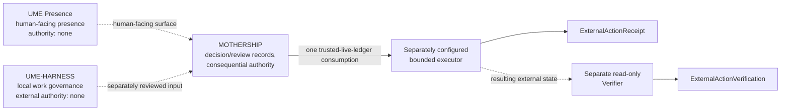
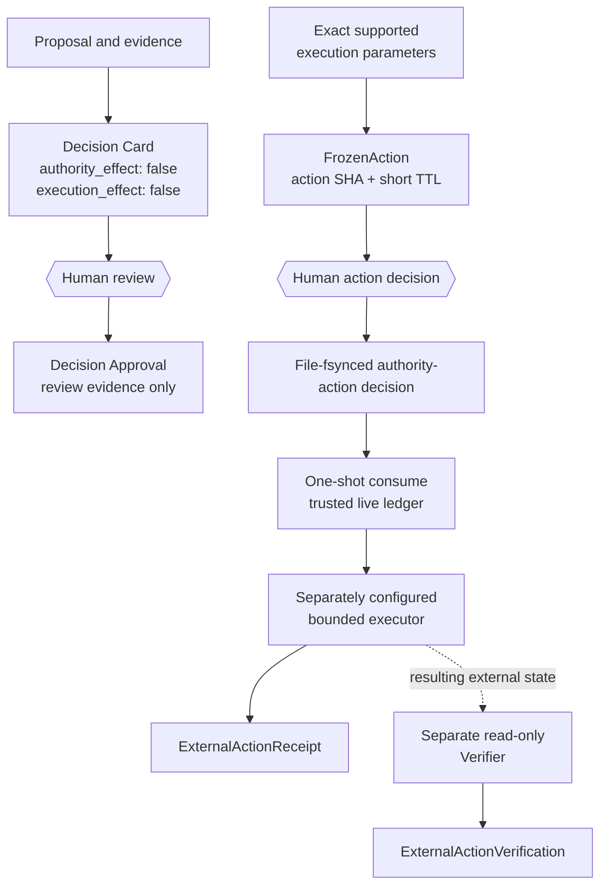
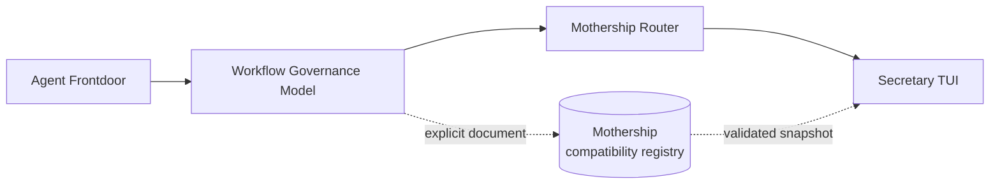

# Architecture

Mothership is the decision and consequential-authority plane in a fixed three-product architecture. It owns the
bounded consequential-authority boundary; it does not run models, choose local workers, or ship a general production
executor.

## Current three-product architecture



| Product | Owns | Authority boundary |
| --- | --- | --- |
| UME Presence | presentation, voice, persona, and human interaction | no decision or execution authority |
| UME-HARNESS | task intake, local execution leases, local tools, and worktree policy | no external consequential authority |
| MOTHERSHIP | bounded decision/review records, exact action freeze, caller-attested binding, authority-action records, and trusted-ledger consume | exact, short-lived, bounded authority only |

This document does not create runtime dependencies between the products. A future Harness-to-Mothership protocol would
require a separate reviewed migration.

Evidence Spine remains the generic append-only evidence owner. Mothership owns
only its bounded decision/review records and authority-action records; it does
not become a general evidence store.

## Five-stage boundary model

The small public model is:

```text
OBSERVE → PROPOSE → APPROVE → EXECUTE → VERIFY
```

This is a semantic boundary model, not a claim that this package performs a
live end-to-end workflow. In the current source:

| Stage | Current meaning | Owner / status |
| --- | --- | --- |
| OBSERVE | source-backed or external evidence input | caller and separately owned evidence surfaces |
| PROPOSE | one closed, non-authorizing consequence proposal | Mothership schema and pure validator |
| APPROVE | caller-attested human decision for one exact action | Mothership binding; human ceremony is external |
| EXECUTE | exact consumed action applied to an external system | separate future bounded executor; not shipped |
| VERIFY | independent read-only observation after execution | separate future verifier; not shipped |

Supporting Source Health, Evidence Spine, Run Lineage, and Agent Decision
components remain separate references. Their validation, lineage, or advisory
output does not create authority, and this repository claims no automatic
runtime integration with them. UME Presence remains presentation-only with
`authority = NONE`; whether it has a machine-enforced prohibition on producing
verified execution state is `UNKNOWN` in this conformance scope.

## Current Mothership flow

Decision review and Action Authority are separate inputs. A Decision Card never automatically becomes a
`FrozenAction`.



`freeze_action()` accepts an `action_id`, the closed `github.merge_pr` operation, and exact execution parameters. It
validates those parameters, derives the human display from them, freezes the action, computes `action_sha256`, and
sets a fixed ten-minute deadline. A caller cannot inject display fields. In particular, `consequence_if_approved` is
derived presentation; it is not executable input.

The current `FrozenAction` parameter set is exactly `repository`,
`pull_request`, `expected_head_sha`, `expected_base`, and `merge_method`.

`FrozenAction` issuance relies on interpreter-local in-memory state. The object cannot be reconstructed after
serialization, restart, or transfer into a fresh interpreter. On POSIX, however, a child forked after issuance inherits
a copy of both the object and the issuance registry; the API therefore does not provide process-identity isolation.
Freeze, human response handling, and `record_action_decision()` must remain in that issuing interpreter lineage and
complete before the fixed TTL. Remote approval transport and distributed multi-process authority are not supported.

`validate_decision_transport()` accepts only `approve` or `reject` bound to the exact `action_id` and action digest.
`record_action_decision()` writes a caller-supplied, action-bound decision to the dedicated authority-action ledger.
The public API does not authenticate human identity; the calling integration must establish the human ceremony before
recording the decision. The action digest excludes `expires_at`; re-freezing the same `action_id` and parameters after
expiry reproduces the digest, so the library does not bind a response to one unique issuance. The integration must use
a fresh action_id for every freeze and correlate each response to the exact live issuance, including the displayed
expiry, before recording it. Delayed or reused responses must be rejected outside this API.

`consume_action()` atomically permits one use in one trusted, non-rollbackable live ledger history, then rejects
approval replay and action replay there. The API has no global or monotonic ledger anchor: copied, forked, rolled-back,
or restored pre-consume state is another replay domain and must not become an authority source. Mismatch, expiry,
malformed state, unsafe ledger paths, and tamper all fail closed.

After file-fsyncing the event, `consume_action()` returns `(consume event, exact validated action)` in that order. It does
not execute the action. Creating a new ledger file does not fsync its parent directory, so crash durability of that new
directory entry is not claimed. The default package and CLI do not contain a general production bounded executor.
Actual external effects require a separately configured bounded executor. The
Executor emits an `ExternalActionReceipt`; a separate read-only Verifier emits
an `ExternalActionVerification`. The package ships neither producer; the v0
contracts below only validate and bind reports from those separate planes.

## V0 non-executing boundary records

Mothership owns the intake schemas for three strict, closed records:

- `consequence-proposal.v0` is a proposal for the current
  `github.merge_pr` profile. It carries the exact target, expected
  `expected_head_sha` / `expected_base` preconditions, and a proposal-only
  `state_sha256` snapshot/reference, plus evidence references and a preserved
  `ELIGIBLE` / `DENY` / `UNKNOWN` policy disposition. There is no v0 path that
  binds this proposal to a `FrozenAction` or Action Authority. Its authority,
  execution, and delegation effects are fixed to `false`.
- `external-action-receipt.v0` is an executor-local report with
  `SUCCESS`, `FAILED`, or `UNKNOWN` status. `SUCCESS` is not verification and
  is not external truth.
- `external-action-verification.v0` is an independent read-only observation
  bound to the exact action. `CONFIRMED`, `MISMATCH`, and `UNKNOWN` remain
  distinct, and the validator does not promote one status into another.

The public `mothership.contracts` facade exposes pure validation and
receipt/verification binding helpers only. Schema validation proves only closed
record shape and the declared action/receipt binding; it does not authenticate
an executor or verifier, operationally isolate an executor, or enforce a
verifier's read-only behavior. It does not infer an external operation from
local work, issue authority from policy or identity evidence, execute a network
mutation, or create delegation or obligation state. A future executor must
re-check mutable external preconditions immediately before mutation; that
check is outside the current package.

## Three approval concepts

| Concept | Meaning | Current role |
| --- | --- | --- |
| Decision Approval | a caller attests that a human reviewed one exact Decision Card | review evidence; no execution authority or identity authentication |
| Legacy Invocation Approval | alias, registry, task, prompt, scope, and invocation evidence plus attempt lifecycle | legacy invocation-evidence compatibility |
| Action Authority Decision / Authority-Action Approval | a caller attests that a human approved or rejected one exact `FrozenAction` digest | canonical current consequential-authority path; human provenance is an integration trust assumption |

`validate_decision_approval_binding()` validates a Decision Card and Decision Approval by canonical-JSON SHA-256 and
`decision_id`. Both objects keep `authority_effect: false` and `execution_effect: false`. The result is evidence of
review, not an action decision.

The legacy `mothership.approval` facade remains backed by `orchestration.lib.ledger` and preserves
`approval_granted`, `attempt_started`, and `attempt_finished` evidence. It is not the owner of new consequential
authority.

## Legacy 0.2 Protocol Compatibility

**Status: 0.2 compatibility surface; preserved for interoperability and history. Not the current three-product
architecture.**



The frozen protocol order remains:

1. `frontdoor-task`
2. `governance-handoff`
3. `router-manifest`
4. `observation-snapshot`

The demo claim remains `protocol-composition-only`. These documents keep `authority_effect` and `execution_effect`
false and do not enter the current authority flow. Frontdoor/WGM/Router-based Decision Card ingestion remains a
compatibility input until a separately reviewed migration.

## Legacy 0.1 compatibility

The packaged `frontdoor`, `safety`, legacy executor registry, invocation contracts, and
`orchestration.lib.ledger` preserve older import and evidence surfaces. They remain distribution compatibility, not
architectural owners. Removing or migrating them would require a major-version decision.

## Installed package and read-only CLI

The distribution is `mothership-control-plane`; Python 3.12 or newer is required and runtime dependencies are empty.
The default CLI remains read-only with respect to consequential external state.

| CLI surface | Responsibility |
| --- | --- |
| `mothership verify` | check immutable packaged resources and protocol consistency |
| `mothership doctor` | run fixed local availability probes in a sanitized environment |
| `mothership protocol` | list or validate frozen 0.2 compatibility protocols |
| `mothership demo` | validate the bundled 0.2 synthetic chain |
| decision-card and decision-batch commands | render review-only Decision Cards or ephemeral batches |
| GitHub observation commands | perform explicit read-only public observation and render candidates or Cards |

No CLI command freezes, records, consumes, or executes an authority action. The GitHub observation commands can issue
read-only requests; they do not mutate GitHub.

## Public modules

| Public module | Implementation source | Contract |
| --- | --- | --- |
| `mothership.action_authority` | `orchestration.lib.action_authority*` | exact action freeze, caller-attested decision, and trusted-live-ledger consume |
| `mothership.scope` | `orchestration.lib.paths` | legacy bounded local paths and staging |
| `mothership.approval` | `orchestration.lib.ledger` | legacy invocation approval and attempt evidence |
| `mothership.adapters` | `orchestration.lib.adapters` | immutable plans and diagnostics |
| `mothership.contracts` | canonical, JSON, contract, registry, decision, and external-action modules | strict data and binding helpers |
| `mothership.protocols` | protocol registry and validator | 0.2 compatibility validation |

The facades keep one authoritative implementation for each behavior. Existing library calls create output or ledger
evidence only for an explicit caller-supplied target; those writes are not side effects of the read-only CLI.

## Immutable packaged resources

Mothership ships immutable packaged resources for the 0.2 compatibility lane: a closed registry, schema snapshots and
SHA-256 digests, golden-path fixtures, inert executor examples, and an inventory. `mothership verify` checks inventory
membership, sizes, hashes, registry shape, schema digests, inert executors, and golden-path transitions.

## Compatibility protocol validation flow

```text
explicit normalized absolute path
  -> no-follow component traversal
  -> bounded regular-file read
  -> strict UTF-8 JSON decode
  -> exact version and closed schema
  -> metadata safety scan
  -> recursively detached result
```

Unknown protocol kinds fail before file access. A schema-valid document remains metadata; validation never promotes it
to a Decision Approval or an Action Authority Decision. See the [protocol reference](protocols.md).

## Trust and failure boundaries

- Exact action inputs and every ledger row are untrusted until their closed validation succeeds.
- FrozenAction decision recording must remain in its issuing interpreter lineage, including any inherited fork state.
- Consume-once semantics require one trusted, non-rollbackable live ledger history.
- Packaged schemas and fixtures are trusted only after inventory and registry hashes pass.
- Explicit local JSON is untrusted and must cross the strict file and schema boundary.
- Diagnostic and observation output is untrusted evidence, never permission.
- Credentials, separately configured executors, external preconditions, receipts, and verification remain outside the
  default CLI.
- Public commands and authority APIs fail closed; they do not retry, repair input, choose a fallback, or reinterpret a
  failed check as success.
