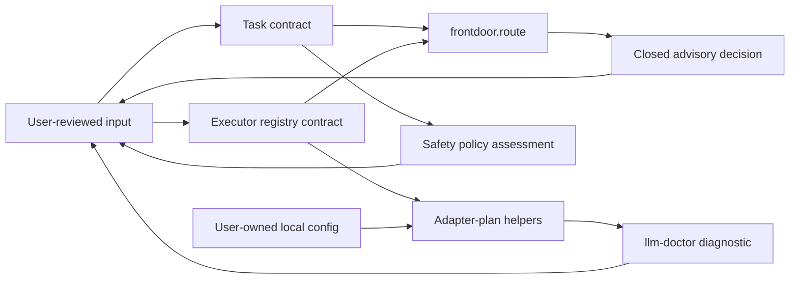

# Architecture

Mothership separates advisory evaluation from any action that could change a machine, a repository, or an external service.

## Components

| Component | Responsibility | Does not do |
| --- | --- | --- |
| `frontdoor/route.py` | Validates a task and registry, then returns a closed advisory decision | Select an executor, start work, or grant authority |
| `frontdoor/contracts/` | Defines the public task and decision shapes | Accept undocumented fields |
| `orchestration/lib/` | Builds immutable local adapter plans and validates registry data | Launch adapter plans or invoke models |
| `orchestration/bin/llm-doctor` | Runs fixed availability diagnostics in a sanitized environment | Install tools, authenticate, modify settings, or call models |
| `safety/policy.py` | Produces a non-authorizing risk assessment | Approve, block, or execute a real-world action |
| `evidence/contracts/` | Defines approval-event data shapes for callers that choose to record evidence | Obtain approval or store secrets automatically |
| `config/` | Holds placeholder-only examples | Carry a usable credential or machine-specific command |

## Advisory routing

`frontdoor.route` accepts a validated task and executor registry. It can return an eligible recommendation in a low-risk case, but its output always has `selected_alias`, `actual_alias`, and `authority_effect` set so that it cannot represent an execution decision. High and unknown risk classes explicitly require human review.

## Diagnostic boundary

`bootstrap/doctor.sh` only resolves the packaged `llm-doctor` executable. The diagnostic uses a fixed command shape for the documented adapter aliases and a sanitized environment. Its output describes availability; it is not a launcher.

## Local ownership boundary

Mothership is useful only when the person operating it reviews local configuration and decides what, if anything, may happen next. Credentials, paths, hooks, settings, and external permissions stay under that person's control.
