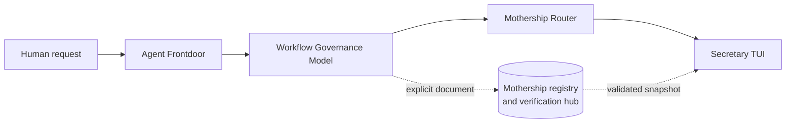

# Architecture

Mothership is an **installable hub** for portable control-plane primitives, protocol compatibility, integrity checks,
and a synthetic composition demo. Its companion repositories are **independently adoptable** products. This topology
creates a shared contract surface without creating ambient runtime authority.

## System shape



The protocol order is fixed:

1. `frontdoor-task`
2. `governance-handoff`
3. `router-manifest`
4. `observation-snapshot`

The demo claim is `protocol-composition-only`. It does not represent approval, worker execution, or task completion.
Where effect fields exist, `authority_effect` and `execution_effect` remain false.

## Installed package

The distribution is `mothership-control-plane` and the command is `mothership`. Python 3.12 or newer is required; the
runtime dependency list is empty.

| Surface | Responsibility |
| --- | --- |
| `mothership verify` | check immutable packaged resources and protocol consistency |
| `mothership doctor` | run fixed local CLI availability probes in a sanitized environment |
| `mothership protocol` | list frozen protocols or validate one explicit local document |
| `mothership demo` | validate the bundled four-stage synthetic chain |

`verify`, `protocol`, and `demo` read immutable packaged resources or an explicitly supplied file. `doctor` can launch
only its fixed diagnostic probes. It never launches a model.

## Public modules

The v0.2 modules are compatibility facades over the existing authoritative implementations:

| Public module | Implementation source | Contract |
| --- | --- | --- |
| `mothership.scope` | `orchestration.lib.paths` | bounded local paths and staging |
| `mothership.approval` | `orchestration.lib.ledger` | approval and attempt evidence |
| `mothership.adapters` | `orchestration.lib.adapters` | immutable plans and diagnostics |
| `mothership.contracts` | canonical, JSON, contract, and registry modules | strict data contracts |
| `mothership.protocols` | Mothership protocol registry and validator | suite interchange validation |

The legacy compatibility layer keeps old imports and command wrappers available in 0.2. The facades do not copy
behavior into a second implementation. Any later removal is a major-version decision.

## Read and write boundaries

The default `mothership` command surface is a **read-only CLI** with respect to repository and user state. Existing
library calls create output or ledger evidence only for an **explicit caller-supplied target**. The preserved
`llm-seat approve` command appends an event only after an explicit invocation and ceremony.

Those write-capable primitives are not side effects of `verify`, `doctor`, `protocol`, or `demo`.

## Immutable resources

Mothership ships these immutable packaged resources:

- a closed protocol registry;
- four schema snapshots with SHA-256 digests;
- five golden-path fixtures;
- inert executor examples;
- an inventory of every packaged Mothership JSON resource.

`mothership verify` checks inventory membership, sizes, hashes, registry shape, schema digests, inert executors, and
golden-path transitions. Package installation can change the selected Python environment; verification does not.

## Protocol validation flow

```text
explicit normalized absolute path
  -> no-follow component traversal
  -> bounded regular-file read
  -> strict UTF-8 JSON decode
  -> exact version and closed schema
  -> metadata safety scan
  -> recursively detached result
```

Unknown protocol kinds fail before file access. A schema-valid document remains metadata; validation never promotes it
to approval. See the [protocol reference](protocols.md).

## Trust boundaries

- Packaged schemas and fixtures are trusted only after their inventory and registry hashes pass.
- Explicit local JSON is untrusted and must cross the strict file and schema boundary.
- Diagnostic child processes are untrusted observations with fixed commands and sanitized environments.
- Credentials, endpoints, installed models, real commands, and execution decisions remain operator-owned state.
- Companion repositories own their domain semantics; Mothership owns only the frozen composition snapshot.

## Failure model

Public commands return one closed JSON result and a documented exit code. They do not retry, repair input, choose a
fallback, discover another checkout, or reinterpret a failed check as success. The operator decides what to do next.
