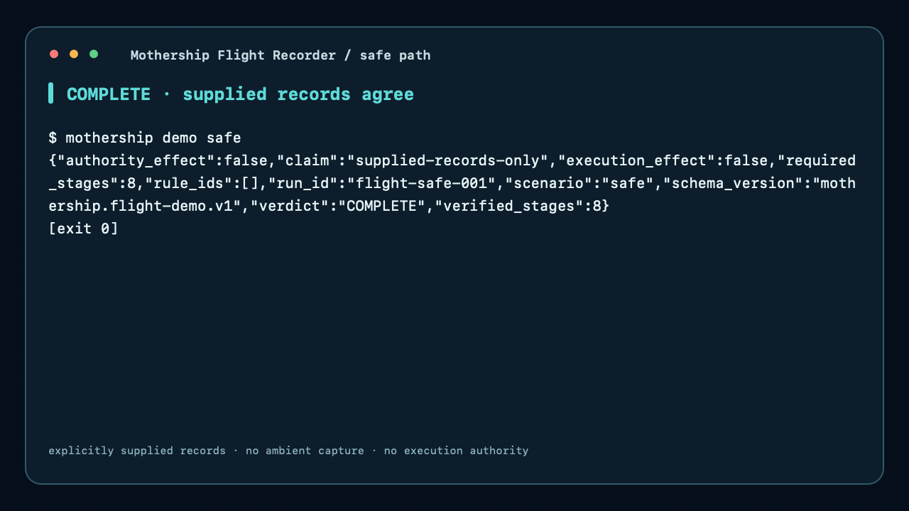
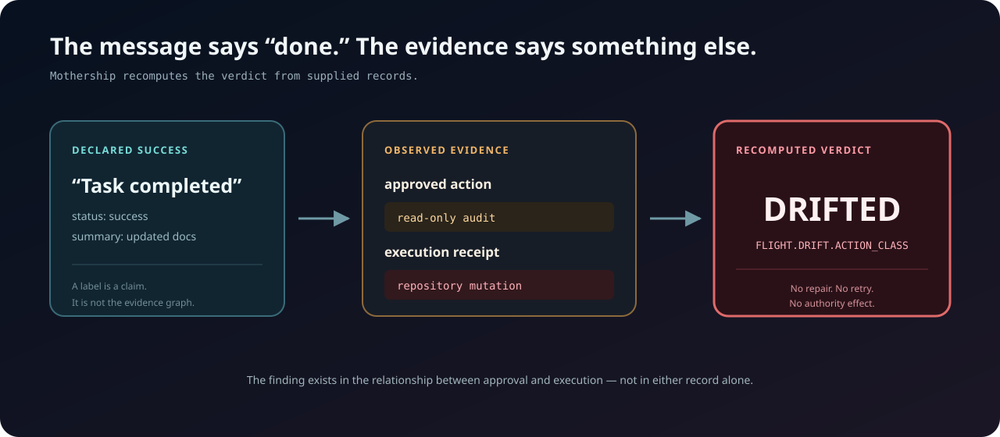
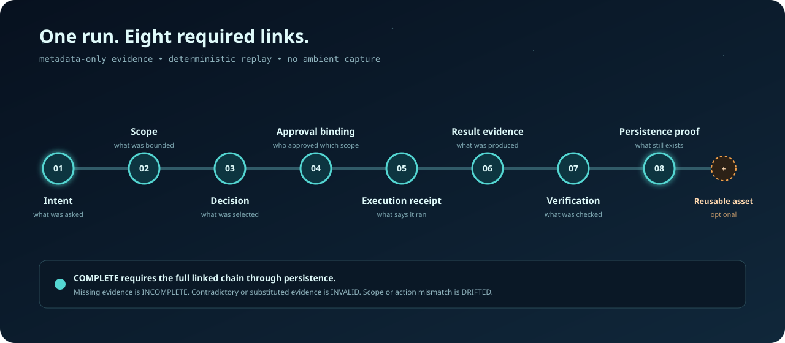

<p align="center">
  
</p>

# Mothership 日本語ガイド

AIエージェントのブラックボックス。
何が許可され、実際に何が起きたかを、証拠から検証する。

Mothershipは、明示的に渡された証拠をローカルで検証する、人が統治するcontrol planeです。agentを起動せず、
ambient stateを収集せず、新しい権限も作りません。

[English](../../README.md) · [Architecture](../architecture.md) · [導入](../installation.md) ·
[Protocol](../protocols.md) · [Security](../security.md) · [Flight Recorder design](../superpowers/specs/2026-08-12-mothership-flight-recorder-design.md)

<p align="center">
  
</p>

<p align="center">
  
</p>

## 60秒でスコープ逸脱を確認

credential不要の2つのfixtureで、safe runとscope mismatchを検証します。下の出力は手書きではなく、実際のCLIが
生成したものです。`mothership demo safe`はexit 0、`mothership demo drift`は検出結果としてexit 21を返します。

<!-- flight-safe-output-ja:start -->
```json
{"authority_effect":false,"claim":"supplied-records-only","execution_effect":false,"required_stages":8,"rule_ids":[],"run_id":"flight-safe-001","scenario":"safe","schema_version":"mothership.flight-demo.v1","verdict":"COMPLETE","verified_stages":8}
```
<!-- flight-safe-output-ja:end -->

<!-- flight-drift-output-ja:start -->
```json
{"authority_effect":false,"claim":"supplied-records-only","execution_effect":false,"required_stages":8,"rule_ids":["FLIGHT.DRIFT.ACTION_CLASS"],"run_id":"flight-drift-001","scenario":"drift","schema_version":"mothership.flight-demo.v1","verdict":"DRIFTED","verified_stages":8}
```
<!-- flight-drift-output-ja:end -->

`COMPLETE`は、渡されたsafe runの証拠が完全でリンクされていることを示します。`DRIFTED`は、渡されたrecordが
approvalを超えるexecution action classを示したことを意味します。必須の証拠がなければ`INCOMPLETE`、形式不正、
置換、矛盾があれば`INVALID`です。

<p align="center">
  
</p>

生成済みの[safe-run report](../generated/flight-safe-report.md)にも、次の境界があります。 “This report verifies
supplied records; it does not grant authority or prove unobserved real-world actions.”

## Mothershipが証明すること

明示的に渡されたrunについて、Mothershipは次の5つを結び付けて評価します。

1. 何が要求されたか。
2. どのscopeとaction classが許可されたか。
3. どのexecution receiptが渡されたか。
4. どのresult evidenceとverificationがclaimを支えるか。
5. どのpersistence proofが完了を支えるか。

evidence graphのmismatchは検出します。ただしrogue AIを止めるものでも、普遍的にpermissionをenforceするものでも、
観測されず渡されなかった事実を証明するものでもありません。

## フライトライフサイクル

正規の順序は次のとおりです。

<p align="center">
  
</p>

```text
Intent
  -> Scope
  -> Decision
  -> Approval binding
  -> Execution receipt
  -> Result evidence
  -> Verification
  -> Persistence proof
  -> Reusable asset (optional)
```

complete runの最小終点はPersistence proofです。Observationはstageまたはrun全体のprojectionであり、完了を意味する
最終stageではありません。

## クイックスタート

source checkoutで、English guideと同じclone-first sequenceを実行します。

<!-- quickstart-ja:start -->
```sh
python3 -m venv .venv
. .venv/bin/activate
python -m pip install .
mothership verify
mothership demo safe
```
<!-- quickstart-ja:end -->

installationではlocalに用意されたbuild toolingが必要になることがあります。installed packageのruntime dependencyは0で、
verificationとsafe demoはofflineです。成功したcheckは実行権限を与えません。

## runをimportして検証する

唯一出荷済みのimporterはGeneric JSONLです。明示したsourceを読み、明示したoutputだけに書きます:
`mothership import generic events.jsonl --out ./flight-001`。続けて`mothership verify run ./flight-001`で評価し、
`mothership replay ./flight-001`でcausal projectionを確認し、`mothership report ./flight-001 --format markdown`で
derived reportを出力できます。

import、verify、replay、reportはagentを起動せず、recordされたactionを再実行せず、home directoryを探索せず、
failed workをretryまたはrepairしません。

## Authority as Data

Intent、Scope、Decision、Approval binding、Execution receipt、Result evidence、Verification、Persistence proofは、
明示的にリンクされたrecordです。valid recordは述べたsubjectについてのevidenceであり、新しいpermissionではありません。

verifierはbundleからverdictを再計算します。優先順位は`INVALID`、`DRIFTED`、`INCOMPLETE`、`COMPLETE`です。

## 安全保証

- 公開Flight commandはすべてexplicit pathを使い、ambient captureやdirectory discoveryをしません。
- `metadata-only`はmetadataだけを保存し、`portable-evidence`はsecret/private-path check後に明示選択されたartifactだけを扱います。
- secret-like key、credential、environment dump、raw prompt body、private absolute path、unsupported binary contentは拒否またはredaction対象です。
- verify、replay、reportはread-onlyです。reportはstandard outputだけへ出ます。
- verifierはrepair、retry、fallback、continuation decisionをしません。

falseまたは省略されたsource recordを含むresidual riskは[Security model](../security.md)を参照してください。

## Mothershipではないもの

- autonomous agent runtime、model router、model launcherではありません。
- permission grant、enforcement plugin、third-party runtime integrationではありません。
- credential manager、prompt archive、environment collector、home-directory copierではありません。
- scheduler、hook installer、daemon、deployment system、retry engine、repair serviceではありません。
- OWASP、NIST、vendor、model providerのcertificationではありません。

## アーキテクチャ

Mothershipはflight bundleのcomposition、run verdict、replay、presentationを所有します。既存companionはsemantic ownershipを
保持し、independently adoptableです。

| Lifecycle responsibility | Existing owner | Mothership responsibility |
| --- | --- | --- |
| Intent and bounded scope | Agent Frontdoor | task artifactをreferenceしてvalidate |
| Evidence and approval semantics | Workflow Governance Model | frozen semanticsをreuse |
| Approval-bound selection | Mothership Router | run内のbindingをverify |
| Worker and team events | Agent Team Runtime | explicit eventだけをimport |
| Append-only evidence | Evidence Spine Core | recordをreferenceしてverify |
| Cross-run relationships | Run Lineage Core | replay/reportへprojection |
| Composition and verdict | Mothership | supplied run全体をevaluate |

Mothership constellationの一員とは、明示的な境界を持ち、各componentがindependently adoptableであることです。
Mothershipはcompanionをinstall、invoke、configureしません。constellationはdiscoveryとcompositionのmapであり、
installed dependency、authority grant、automatic integrationではありません。

<p align="center">
  
</p>

v0.3 graphとv0.2 compatibility projectionは[Architecture](../architecture.md)を参照してください。

## 公開API

安定したpublic command surfaceには`import generic`、`verify run`、`replay`、`report`、`demo safe`、`demo drift`があります。
`mothership.scope`、`mothership.approval`、`mothership.adapters`、`mothership.contracts`、`mothership.protocols`はv0.2
compatibilityのために維持されます。

## エコシステムプロトコル

v0.2 protocol demoは、complete real-world lifecycleではなくcompatibility projectionとして引き続き利用できます:
`frontdoor-task` -> `governance-handoff` -> `router-manifest` -> `observation-snapshot`。

| Protocol kind | Version | Semantic owner |
| --- | --- | --- |
| `frontdoor-task` | `intake.v0` | [Agent Frontdoor](https://github.com/UMEBOSHIISAN/agent-frontdoor) |
| `governance-handoff` | `1.1` | [Workflow Governance Model](https://github.com/UMEBOSHIISAN/workflow-governance-model) |
| `router-manifest` | `1.0` | [Mothership Router](https://github.com/UMEBOSHIISAN/mothership-router) |
| `observation-snapshot` | `1.0` | [Secretary TUI](https://github.com/UMEBOSHIISAN/secretary-tui) |

projectionはsupplied protocol documentをvalidateします。`authority_effect: false`と`execution_effect: false`はFlightの
approval/execution eventを記述するものではありません。

## 互換性

MothershipはPython 3.12+とzero runtime dependenciesを要求します。measured environmentはPython 3.14.6 on macOSです。
unmeasuredなPython、OS、package、adapter formをsupport claimにはしません。`0.2.0` projectionには
`claude-code-agent`、`codex-cli`、`ollama-local` diagnosticがあります。Ollama detail probeだけは既存default loopback
daemonをqueryする場合があります。[Compatibility matrix](../compatibility.md)はmeasured factとprojection/candidateを分けます。

モデルを呼び出しません。権限を与えません。companionを自動インストールしません。従来の合成コーパスの結果は本番精度ではありません。
v0.2 compatibilityのpinned companion commitはpublic main branchから到達可能です。

## ドキュメント

| 必要なこと | 文書 |
| --- | --- |
| Flight bundle modelとowner | [Architecture](../architecture.md) |
| index、event、version、verdict contract | [Protocols](../protocols.md) |
| explicit I/O、privacy、residual risk | [Security](../security.md) |
| installationとcommand effect | [Installation](../installation.md) |
| measured/unmeasured environment | [Compatibility](../compatibility.md) |
| shipped/candidate adapter | [Roadmap](../ecosystem-roadmap.md) |

## コントリビューション

[CONTRIBUTING.md](../../CONTRIBUTING.md)を参照してください。new behaviorはfailing testから始め、public claimには
executable evidenceまたはexplicit limitationが必要です。protocol semanticsはownerに残ります。

## セキュリティ

脆弱性は[SECURITY.md](../../SECURITY.md)のprivate advisory手順で報告してください。credential、private path、personal data、
exploit detailをpublic issueに含めないでください。

## ロードマップ

[Ecosystem roadmap](../ecosystem-roadmap.md)は出荷済みGeneric JSONL importとcandidateのvendor adapterを分けます。
adoption number、platform coverage、certificationは示しません。

## ライセンス

Mothershipは[MIT License](../../LICENSE)で公開します。

## ブラックボックスを育てる

Mothershipが検証するのは、明示的に渡されたrecordだけです。モデルを呼び出さず、agentを実行せず、権限を付与しません。
この境界に共感したら、英語版READMEの案内からMothershipを応援してください。
