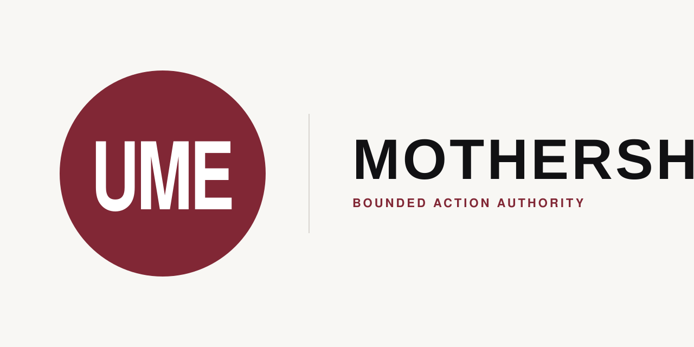
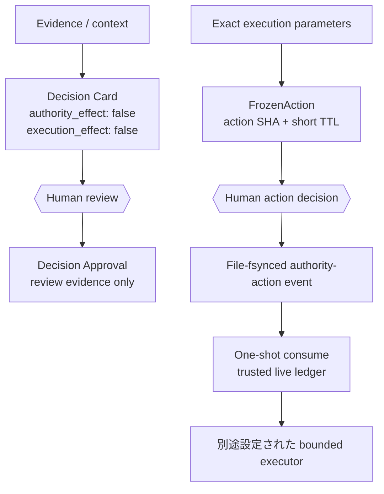

<p align="center">
  
</p>

# Mothership 日本語ガイド

<p align="center"><strong>AIのための、範囲を限定したAction Authority。</strong></p>

<p align="center"><strong>ひとつの人間判断。ひとつの具体的操作。1回だけ。</strong></p>

Mothershipは、範囲を限定したconsequential authorityの境界を所有します。1つのexact actionをfreezeし、そのSHA-256へ
callerがhuman decisionとしてattestした判断をbindし、eventをfile-fsyncして、1つのtrustedかつnon-rollbackableな
live ledger history内でauthorityを一度だけconsumeできます。default CLIはread-onlyのままです。

public APIはexact bindingを検証しますが、人間のidentity、globalに唯一でmonotonicなledger、または新規ledgerの
directory entryに対するcrash durabilityを保証しません。`FrozenAction` issuanceはinterpreter-local stateに依存しますが、
発行後にPOSIX forkされたchildはそのstateのcopyを継承するため、process identity isolationではありません。
integration側がhuman ceremonyを確立し、freezeからdecision記録までをそのissuance lineage内に保ち、rollbackされない
1つのtrusted live ledger historyを使う必要があります。

action digestは`expires_at`を含まないため、libraryはdecisionを1つのunique issuanceへbindしません。integrationは
freezeごとにfreshな`action_id`を生成し、人間へ示したexact live issuanceとexpiryへresponseをcorrelateして、遅延または
再利用されたresponseを拒否する必要があります。同じIDとparameterでexpired actionを再freezeすると、古いmatching
decisionをfresh inputとして受け入れ得ます。

モデルを呼び出しません。local workerを選ばず、retryせず、ambient authorityを与えず、重要操作を自動承認しません。
実際のexternal side effectには、別途設定されたbounded executorが必要です。

[English](../../README.md) · [設計](../architecture.md) · [導入](../installation.md) ·
[protocol](../protocols.md) · [安全モデル](../security.md) · [研究証跡](../research/paper-evidence.md)

## クイックスタート

Mothershipのsource checkoutで次の5コマンドを実行します。

<!-- quickstart-ja:start -->
```sh
python3 -m venv .venv
. .venv/bin/activate
python -m pip install .
mothership verify
mothership demo
```
<!-- quickstart-ja:end -->

インストール時はbuild toolを取得する場合があります。インストール後のruntime dependencyは0です。`verify`と
`demo`はofflineで動きます。成功はartifactの整合性を示しますが、実行権限を与えません。

<p align="center">
  
</p>

## 0.2互換チェーンを60秒で検証

`mothership demo`は、freeze済み0.2互換チェーンの4つの架空文書を検証して、毎回同じJSONを出力します。

<!-- demo-output-ja:start -->
```json
{"authority_effect":false,"capability":"code-review","claim":"protocol-composition-only","execution_effect":false,"schema_version":"mothership.demo.v1","stages":[{"kind":"frontdoor-task","schema_version":"intake.v0","valid":true},{"kind":"governance-handoff","schema_version":"1.1","valid":true},{"kind":"router-manifest","schema_version":"1.0","valid":true},{"kind":"observation-snapshot","schema_version":"1.0","valid":true}],"status":"passed","task_id":"demo-review-001"}
```
<!-- demo-output-ja:end -->

これは4種類のversioned protocolが合成できた、という意味だけです。agent実行、human approval、実タスク完了を
意味しません。

## 課題

AI開発環境は、CLI、local model、alias、policy file、端末固有の設定が少しずつ積み重なってできます。
home directoryを丸ごとコピーすれば速い一方、秘密情報や不要な権限まで運びがちです。
記憶だけで再構築すれば、重要な境界を再現できません。

本当に運びたいものはbinaryだけではなく、次の区別です。

- 共有してよい構造
- 各マシンに残す秘密情報
- recommendationにすぎない状態
- 明示的なhuman authorityが必要な状態
- 境界を守ったと確認できるevidence

## Mothershipの答え

Mothershipは、この区別を実行可能なcontractとして提供します。

- `mothership` commandを持つ標準Python package
- `FrozenAction`、action SHA、short TTL、caller-attested binding、same-live-ledger replay rejection
- strict JSONとfail-closedなlocal file boundary
- 4つの0.2 compatibility protocolを固定するregistry
- executionなしでcompositionを確かめるdeterministic demo
- packaged resourceのdigestとoffline integrity check
- scope、legacy invocation approval、adapter、contractのcompatibility facade
- claim limitを明示した再現可能な評価器

原則は、**propositionをreviewし、exactで短命な1操作だけをauthorizeする**ことです。

## アーキテクチャ

現在のtop-level productは次の3つです。

```mermaid
flowchart LR
    U[UME Persona (private)<br/>presentation / persona<br/>authority: none]
    H[UME-HARNESS<br/>local work governance<br/>external authority: none]
    M[MOTHERSHIP<br/>decision / consequential authority]
    X[別途設定された<br/>bounded executor]

    U -. human-facing surface .-> M
    H -. proposal / evidence .-> M
    M -->|one trusted-live-ledger consumption| X
```

| Product | 担当 | 所有しないもの |
| --- | --- | --- |
| UME Persona (private) | presentation、voice、persona、human-facing interaction | decision / execution authority |
| UME-HARNESS | task intake、LocalExecutionLease、local tool / worktree policy | external consequential authority |
| MOTHERSHIP | evidence、decision、exact action freeze、caller-attested binding、trusted-ledger consume | model / worker execution |

### Legacy 0.2 protocol compatibility

Frontdoor → WGM → Router → Secretaryは、interoperabilityとhistoryのために保存する0.2 compatibility surfaceです。
現在の3 product architectureではありません。Mothershipはcompanionを探さず、自動インストールしません。

### Consequential authority boundary

Decision Card reviewとAction Authorityは別々の入力です。Decision Cardが自動的に`FrozenAction`へ変換されることは
ありません。callerがexactな`github.merge_pr` execution parameterを`freeze_action()`へ別途渡します。



**Decision Card**（`evidence/contracts/decision-card.v0.schema.json`）は人間向けの判断材料です。question、
recommendation、named unknowns、そしてpresentation専用の`consequence_if_approved`を持ちます。statusを持たず、
workerも選択しません。

**Decision Approval**（`evidence/contracts/decision-approval.v0.schema.json`）は、callerが「人間がまさにそのCardを
reviewした」とattestした記録です。`mothership.contracts`からexportされる
`validate_decision_approval_binding()`はcontent bindingを機械的に検証します。Cardのcanonical JSON SHA-256を
再計算し、Approvalが持つdigestと`decision_id`が厳密一致することを要求しますが、reviewerのidentityは認証しません。
approval後にCardを編集するとbindingは無効になります。

似た名前の既存2 schemaとは明確に別物です。

- `decision`（`frontdoor/contracts/decision.schema.json`）：Agent Frontdoorのadvisory routing結果。machineの
  recommendationであり、human judgmentの記録ではありません。
- `approval-event`（`evidence/contracts/approval-event.schema.json`）：invocation/execution側のevidence
  （`attempt_started` / `attempt_finished`）。binding codeのどこにもDecision Approvalとの接続はありません。

Decision Approvalはcommand・worker選択・invocation・実行済みの証拠のいずれでもありません。

**Action Authority Decision / Authority-Action Approval**は、現在のconsequential authorityです。
`mothership.action_authority`は`FrozenAction`、`action_sha256`、`freeze_action`、
`validate_decision_transport`、`record_action_decision`、`consume_action`を公開します。actionのdisplayはvalidated
execution parameterからderiveされ、`consequence_if_approved`をexecution inputとして受け取りません。
APIはhuman identityを認証しません。`FrozenAction`はrestart後やfresh interpreterでは再構築できませんが、発行後に
POSIX forkされたchildはobjectとissuance registryのcopyを継承します。したがってprocess identity isolationではなく、
freezeからdecision記録までをそのissuance lineage内で完了させる必要があります。replay rejectionはtrustedかつ
non-rollbackableな1つのlive ledger history内だけの保証です。copy、rollback、restoreされたpre-consume stateは別の
replay opportunityになります。event fileは`fsync`されますが、新規file作成時のparent directory entryは`fsync`されず、
そのcrash durabilityは保証しません。

**Legacy Invocation Approval**は`mothership.approval`の互換APIです。alias、registry、task、prompt、scope、invocation
digestと`approval_granted` / `attempt_started` / `attempt_finished`を扱いますが、新しい重要操作の正本ではありません。

## 導入パス

### 1. Mothershipだけ — 最初の推奨

installして`mothership verify`を実行し、public library APIを確認します。default CLIはread-onlyで、Action Authority
APIを利用してもbounded executorは追加されません。

### 2. companionを1つ追加

legacy 0.2 companionを別途installし、その公開interchange documentだけをMothershipへ渡します。repository
discoveryやshared credentialはありません。

### 3. 4段の合成chain

`mothership demo`でbundled 0.2 fixtureの全transitionを検証します。chainはsyntheticかつread-onlyで、現在の
Action Authority pathとは別です。

## 安全保証

公開`mothership` CLIについて、次を保証範囲にします。

- `verify`、`protocol`、`demo`はread-onlyです。
- duplicate key、non-finite number、malformed UTF-8、unknown field、unsupported versionを拒否します。
- protocol fileはnormalized absolute pathのbounded regular fileに限定し、symlinkをたどりません。
- valid documentをapproval、selection、execution、task completionへ昇格させません。
- モデルを呼び出しません。GitHub credentialを受け取らず、retryやbackground serviceも作りません。
- consequentialなexternal mutationを行うCLI commandはありません。
- GitHub observation commandは明示したpublic endpointへread-only requestを行う場合があります。GitHub
  `Authorization`は追加しませんが、system proxy設定とproxy authenticationはstandard-library openerが継承します。
- `doctor ollama-local`だけは、既存Ollamaのdefault loopback daemonへ問い合わせる場合があります。

既存library APIの一部は、programmerがtargetを明示した場合だけbounded staging、legacy invocation evidence、または
authority-action ledger eventを書けます。default CLIの暗黙side effectではありません。

## Mothershipではないもの

- autonomous agent runtimeではありません。
- model routerやmodel launcherではありません。
- secret managerやhome-directory copierではありません。
- scheduler、hook manager、daemon、deployment system、retry engineではありません。
- general production executorではありません。default CLIはconsequential mutationを行いません。
- diagnosticが成功しただけで環境全体が安全になった、という証明ではありません。
- 最終的に実作業を行うcommandのhuman reviewを置き換えません。

## 比較

| 観点 | Mothership | home directory copy | agent framework | model router |
| --- | --- | --- | --- | --- |
| 主目的 | bounded consequential authority | machine state複製 | agent workflow実行 | model traffic選択 |
| secretを含むか | 含めない | 含み得る | 設定次第 | 設定次第 |
| authority scope | exact / caller-attested / trusted-live-ledger action | 既存stateを複製 | framework次第 | 通常はなし |
| external effect | separate bounded executorが必要 | copied tool次第 | 一般に行う | inference request |
| offline integrity | built in | 手動 | framework次第 | service次第 |

これはcategoryの違いであり、普遍的な優劣表ではありません。Mothershipはagent frameworkや
model routerの隣に置けます。

## 公開API

| Module | 用途 |
| --- | --- |
| `mothership.action_authority` | exact action freeze、caller-attested decision、trusted-live-ledger consume |
| `mothership.scope` | legacy bounded path、measurement、staging、locking |
| `mothership.approval` | legacy invocation-evidence compatibilityとattempt lifecycle |
| `mothership.adapters` | immutable adapter planとfixed diagnostic |
| `mothership.contracts` | strict JSON、hash、contract、registry helper（Decision Card / Decision Approval binding: `validate_decision_approval_binding`を含む） |
| `mothership.protocols` | ecosystem interchange documentの検証 |

0.2.0ではlegacy import pathも維持します。削除する場合は将来のmajor-version decisionが必要です。

## エコシステムプロトコル

**Status: 0.2 compatibility surface。interoperabilityとhistoryのために保存し、現在の3 product architectureには
しません。**

0.2.0でfreezeしたcompatibility registryは次の順序を固定します。

| Protocol kind | Version | Semantic owner |
| --- | --- | --- |
| `frontdoor-task` | `intake.v0` | [Agent Frontdoor](https://github.com/UMEBOSHIISAN/agent-frontdoor) |
| `governance-handoff` | `1.1` | [Workflow Governance Model](https://github.com/UMEBOSHIISAN/workflow-governance-model) |
| `router-manifest` | `1.0` | [Mothership Router](https://github.com/UMEBOSHIISAN/mothership-router) |
| `observation-snapshot` | `1.0` | [Secretary TUI](https://github.com/UMEBOSHIISAN/secretary-tui) |

Mothershipはcomposition snapshotを所有しますが、各domain semanticsはowner側に残ります。schema変更時はowner release、
bundled snapshot、digest、fixture、compatibility table、conformance testを同時に更新します。

開発用companion auditは4つのrepository rootを明示的に受け取り、exact commit、owner schema bytes、public example、
chain continuityを検証します。repositoryを自動探索しません。今回検証したcommitは
[互換性matrix](../compatibility.md)に固定しており、各repositoryのpublic main branchから到達可能です。

## 互換性

- 対応宣言: Python 3.12+
- runtime dependency: 0
- measured Wave 1 environment: Python 3.14.6 on macOS
- diagnostic alias: `claude-code-agent`、`codex-cli`、`ollama-local`
- protocol: 4種類、すべてnon-authorizingかつnon-executing
- effect constant: `authority_effect: false`、`execution_effect: false`
- current authority profile: exact / caller-attested / short-livedで、trustedかつnon-rollbackableな1つのlive ledger
  history内でconsume-onceとなる`github.merge_pr`

tracked evaluatorではvalid protocol 4/4、synthetic invalid mutation 20/20、8つのcontrolled process environmentで
byte-identical output 1種類でした。Agent Frontdoorのpublic labeled corpusではpositive 31/31、negative issue code
41/41、unsafe drift 16/16、safe control 4/4でした。

これらは内部の合成コーパスに対する結果で、本番精度ではありません。denominatorと限界は
[論文用の証跡とclaim boundary](../research/paper-evidence.md)を参照してください。

## ドキュメント

| 目的 | 文書 |
| --- | --- |
| install、update、uninstall | [導入ライフサイクル](../installation.md) |
| trust boundary | [Architecture](../architecture.md) |
| companion composition | [Composition guide](../composition.md) |
| schemaとversion | [Protocol reference](../protocols.md) |
| threatとresidual risk | [Security model](../security.md) |
| measured support | [Compatibility](../compatibility.md) |
| shipped/candidate/excluded | [Roadmap](../ecosystem-roadmap.md) |

## コントリビューション

[CONTRIBUTING.md](../../CONTRIBUTING.md)を参照してください。behavior changeはfailing testから始め、protocol変更はsemantic
ownerと調整します。public claimは実行可能なcheckまたは限界付きevidenceへ結び付けます。

## セキュリティ

脆弱性は[SECURITY.md](../../SECURITY.md)のprivate advisory手順で報告してください。
credential、private path、個人情報、exploit detailをpublic issueへ書かないでください。

## ロードマップ

exact `FrozenAction`、caller-attested authority decision、issuanceごとのshort TTL、file-fsynced event、
same-live-ledger replay rejectionは実装済みです。fresh action IDとlive-response correlationはintegration要件です。
autonomous approval、ambient authority、model execution、local worker routing、retry、generic executor selection、
background action loopは現在の境界外です。

[Ecosystem roadmap](../ecosystem-roadmap.md)はimplemented、candidate、not current / plannedを分離しています。

## ライセンス

Mothershipは[MIT License](../../LICENSE)で公開します。
