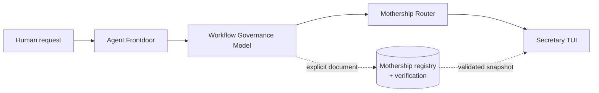
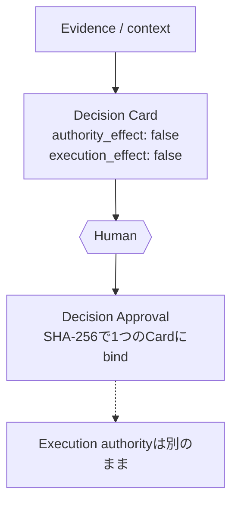

<p align="center">
  
</p>

# Mothership 日本語ガイド

<p align="center"><strong>AIコーディング環境のための、持ち運べる安全第一のコントロール基盤。</strong></p>

<p align="center"><strong>運ぶのは構造。秘密情報と実行権限はローカルに残す。</strong></p>

Mothershipは、AIコーディング環境を別のマシンでも検査可能な形で再現するために、契約、protocol snapshot、
整合性検証、ローカル診断をまとめるinstallable hubです。モデルを呼び出しません。executorを選択せず、
検証結果を許可へ昇格させません。

[English](../../README.md) · [設計](../architecture.md) · [導入](../installation.md) ·
[protocol](../protocols.md) · [安全モデル](../security.md) · [研究証跡](../research/paper-evidence.md)

## クイックスタート

Mothershipのsource checkoutで次の5コマンドを実行します。

<!-- quickstart-ja:start -->
```sh
python3 -m venv .venv
. .venv/bin/activate
python -m pip install .
mothership verify
mothership demo
```
<!-- quickstart-ja:end -->

インストール時はbuild toolを取得する場合があります。インストール後のruntime dependencyは0です。`verify`と
`demo`はofflineで動きます。成功はartifactの整合性を示しますが、実行権限を与えません。

<p align="center">
  
</p>

## 60秒で全体を確認

`mothership demo`は、4つの境界に置かれた架空の文書を検証して、毎回同じJSONを出力します。

<!-- demo-output-ja:start -->
```json
{"authority_effect":false,"capability":"code-review","claim":"protocol-composition-only","execution_effect":false,"schema_version":"mothership.demo.v1","stages":[{"kind":"frontdoor-task","schema_version":"intake.v0","valid":true},{"kind":"governance-handoff","schema_version":"1.1","valid":true},{"kind":"router-manifest","schema_version":"1.0","valid":true},{"kind":"observation-snapshot","schema_version":"1.0","valid":true}],"status":"passed","task_id":"demo-review-001"}
```
<!-- demo-output-ja:end -->

これは4種類のversioned protocolが合成できた、という意味だけです。agent実行、human approval、実タスク完了を
意味しません。

## 課題

AI開発環境は、CLI、local model、alias、policy file、端末固有の設定が少しずつ積み重なってできます。
home directoryを丸ごとコピーすれば速い一方、秘密情報や不要な権限まで運びがちです。
記憶だけで再構築すれば、重要な境界を再現できません。

本当に運びたいものはbinaryだけではなく、次の区別です。

- 共有してよい構造
- 各マシンに残す秘密情報
- recommendationにすぎない状態
- 明示的なhuman authorityが必要な状態
- 境界を守ったと確認できるevidence

## Mothershipの答え

Mothership 0.2.0は、この区別を実行可能なcontractとして提供します。

- `mothership` commandを持つ標準Python package
- strict JSONとfail-closedなlocal file boundary
- 4つのcompanion protocolを固定するregistry
- executionなしでcompositionを確かめるdeterministic demo
- packaged resourceのdigestとoffline integrity check
- scope、approval ledger、adapter、contractのcompatibility facade
- claim limitを明示した再現可能な評価器

原則は、**構造を共有し、credential・selection・execution authorityはlocalに残す**ことです。

## アーキテクチャ

Mothershipはinstall、verification、protocol compatibilityを担うhubです。各companionは独立して利用できます。



図の矢印はprocess launchではありません。Mothershipはcompanionを探さず、
自動インストールしません。人が明示的に渡したdocumentだけを、固定されたsnapshotで検証します。

| Layer | 担当 | 意味しないもの |
| --- | --- | --- |
| Agent Frontdoor | bounded task intake | worker invocation |
| Workflow Governance Model | evidence relationship | approval |
| Mothership Router | human-gated recommendation | execution |
| Secretary TUI | supplied stateの表示 | freshness |
| Mothership | package、protocol、integrity | ambient authority |

### Human decision boundary（人間の判断境界）

上の図はProtocol Composition Chainです。4つの独立したtoolのinterchange documentがschema互換か・順序が繋がっているか
を検証するもので、「次に人間が何をすべきか」には答えません。その別の問いには、library-levelの独立したcontractが
あります（CLI subcommandはまだありません）。



**Decision Card**（`evidence/contracts/decision-card.v0.schema.json`）は人間向けの判断材料です。question、
recommendation、named unknowns、そしてpresentation専用の`consequence_if_approved`を持ちます。statusを持たず、
workerも選択しません。

**Decision Approval**（`evidence/contracts/decision-approval.v0.schema.json`）は、人間がまさにそのCardをreviewした
ことを記録します。`mothership.contracts`からexportされる`validate_decision_approval_binding()`が機械的に検証します。
CardのcanonicalJSON SHA-256を再計算し、Approvalが持つdigestと`decision_id`が厳密一致することを要求します。approval
後にCardを編集するとbindingは無効になります。

似た名前の既存2 schemaとは明確に別物です。

- `decision`（`frontdoor/contracts/decision.schema.json`）：Agent Frontdoorのadvisory routing結果。machineの
  recommendationであり、human judgmentの記録ではありません。
- `approval-event`（`evidence/contracts/approval-event.schema.json`）：invocation/execution側のevidence
  （`attempt_started` / `attempt_finished`）。binding codeのどこにもDecision Approvalとの接続はありません。

Decision Approvalはcommand・worker選択・invocation・実行済みの証拠のいずれでもありません。

## 導入パス

### 1. Mothershipだけ — 最初の推奨

installして`mothership verify`、`mothership protocol list`、必要なdiagnosticを実行します。companionなしでも、
portable control-plane primitiveを利用できます。

### 2. companionを1つ追加

Agent Frontdoor、Workflow Governance Model、Mothership Router、Secretary TUIのどれかを別途installし、その公開
interchange documentだけをMothershipへ渡します。repository discoveryやshared credentialはありません。

### 3. 4段の合成chain

`mothership demo`でbundled fixtureの全transitionを検証します。chainはsyntheticかつread-onlyで、実作業の起動は
製品境界の外です。

## 安全保証

公開`mothership` CLIについて、次を保証範囲にします。

- `verify`、`protocol`、`demo`はread-onlyです。
- duplicate key、non-finite number、malformed UTF-8、unknown field、unsupported versionを拒否します。
- protocol fileはnormalized absolute pathのbounded regular fileに限定し、symlinkをたどりません。
- valid documentをapproval、selection、execution、task completionへ昇格させません。
- モデルを呼び出しません。credentialを読まず、retryやbackground serviceも作りません。
- Mothershipがexternal network targetを指定することはありません。
- `doctor ollama-local`だけは、既存Ollamaのdefault loopback daemonへ問い合わせる場合があります。

既存library APIの一部は、programmerがtargetを明示した場合だけbounded stagingまたはledger eventを書けます。
default CLIの暗黙side effectではありません。

## Mothershipではないもの

- autonomous agent runtimeではありません。
- model routerやmodel launcherではありません。
- secret managerやhome-directory copierではありません。
- scheduler、hook manager、daemon、deployment system、retry engineではありません。
- diagnosticが成功しただけで環境全体が安全になった、という証明ではありません。
- 最終的に実作業を行うcommandのhuman reviewを置き換えません。

## 比較

| 観点 | Mothership | home directory copy | agent framework | model router |
| --- | --- | --- | --- | --- |
| 主目的 | portable control plane | machine state複製 | agent workflow実行 | model traffic選択 |
| secretを含むか | 含めない | 含み得る | 設定次第 | 設定次第 |
| authority | 与えない | 既存stateを複製 | framework次第 | 通常は与えない |
| work execution | しない | copied tool次第 | 一般に行う | inference request |
| offline integrity | built in | 手動 | framework次第 | service次第 |

これはcategoryの違いであり、普遍的な優劣表ではありません。Mothershipはagent frameworkや
model routerの隣に置けます。

## 公開API

| Module | 用途 |
| --- | --- |
| `mothership.scope` | bounded path、measurement、staging、locking |
| `mothership.approval` | single-use approval-bound attempt evidence |
| `mothership.adapters` | immutable adapter planとfixed diagnostic |
| `mothership.contracts` | strict JSON、hash、contract、registry helper（Decision Card / Decision Approval binding: `validate_decision_approval_binding`を含む） |
| `mothership.protocols` | ecosystem interchange documentの検証 |

0.2.0ではlegacy import pathも維持します。削除する場合は将来のmajor-version decisionが必要です。

## エコシステムプロトコル

registryは次の順序を固定します。

| Protocol kind | Version | Semantic owner |
| --- | --- | --- |
| `frontdoor-task` | `intake.v0` | [Agent Frontdoor](https://github.com/UMEBOSHIISAN/agent-frontdoor) |
| `governance-handoff` | `1.1` | [Workflow Governance Model](https://github.com/UMEBOSHIISAN/workflow-governance-model) |
| `router-manifest` | `1.0` | [Mothership Router](https://github.com/UMEBOSHIISAN/mothership-router) |
| `observation-snapshot` | `1.0` | [Secretary TUI](https://github.com/UMEBOSHIISAN/secretary-tui) |

Mothershipはcomposition snapshotを所有しますが、各domain semanticsはowner側に残ります。schema変更時はowner release、
bundled snapshot、digest、fixture、compatibility table、conformance testを同時に更新します。

開発用companion auditは4つのrepository rootを明示的に受け取り、exact commit、owner schema bytes、public example、
chain continuityを検証します。repositoryを自動探索しません。今回検証したcommitは
[互換性matrix](../compatibility.md)に固定しており、各repositoryのpublic main branchから到達可能です。

## 互換性

- 対応宣言: Python 3.12+
- runtime dependency: 0
- measured Wave 1 environment: Python 3.14.6 on macOS
- diagnostic alias: `claude-code-agent`、`codex-cli`、`ollama-local`
- protocol: 4種類、すべてnon-authorizingかつnon-executing
- effect constant: `authority_effect: false`、`execution_effect: false`

tracked evaluatorではvalid protocol 4/4、synthetic invalid mutation 20/20、8つのcontrolled process environmentで
byte-identical output 1種類でした。Agent Frontdoorのpublic labeled corpusではpositive 31/31、negative issue code
41/41、unsafe drift 16/16、safe control 4/4でした。

これらは内部の合成コーパスに対する結果で、本番精度ではありません。denominatorと限界は
[論文用の証跡とclaim boundary](../research/paper-evidence.md)を参照してください。

## ドキュメント

| 目的 | 文書 |
| --- | --- |
| install、update、uninstall | [導入ライフサイクル](../installation.md) |
| trust boundary | [Architecture](../architecture.md) |
| companion composition | [Composition guide](../composition.md) |
| schemaとversion | [Protocol reference](../protocols.md) |
| threatとresidual risk | [Security model](../security.md) |
| measured support | [Compatibility](../compatibility.md) |
| shipped/candidate/excluded | [Roadmap](../ecosystem-roadmap.md) |

## コントリビューション

[CONTRIBUTING.md](../../CONTRIBUTING.md)を参照してください。behavior changeはfailing testから始め、protocol変更はsemantic
ownerと調整します。public claimは実行可能なcheckまたは限界付きevidenceへ結び付けます。

## セキュリティ

脆弱性は[SECURITY.md](../../SECURITY.md)のprivate advisory手順で報告してください。
credential、private path、個人情報、exploit detailをpublic issueへ書かないでください。

## ロードマップ

0.2.0はinstallable hub、4段protocol、deterministic demo、evaluation、documentationに集中します。automatic execution、
companion installation、credential management、retry、background serviceは現在の境界では計画しません。

[Ecosystem roadmap](../ecosystem-roadmap.md)はshipped、candidate、not plannedを分離しています。

## ライセンス

Mothershipは[MIT License](../../LICENSE)で公開します。
